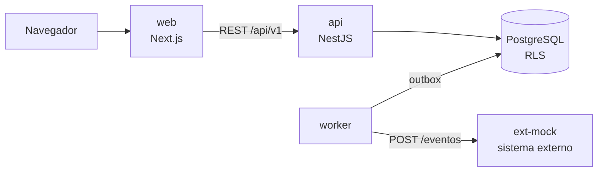
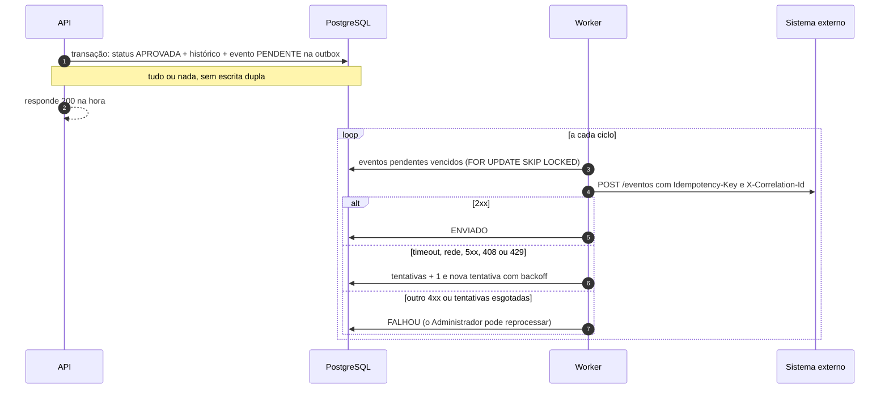

# Gestão de Solicitações Internas

Protótipo web para centralizar as solicitações internas que hoje se espalham por e-mail, chat e planilhas: cada pedido tem dono, prioridade, andamento e histórico, e a operação ganha indicadores.

- [Funcionalidades](#funcionalidades)
- [Como executar](#como-executar) · [Usuários de demonstração](#usuários-de-demonstração)
- [Arquitetura](#arquitetura) · [Qualidade](#qualidade)
- [Premissas](#premissas) · [Critérios de priorização](#critérios-de-priorização)
- [Limitações conhecidas](#limitações-conhecidas) · [O que ficou pendente](#o-que-ficou-pendente)
- [Evolução da solução](#evolução-da-solução) · [Integração com sistema externo](#integração-com-sistema-externo-após-a-aprovação)
- [Uso responsável de IA](#uso-responsável-de-ia) · [Próximos passos](#próximos-passos)
- [Documentação detalhada](#documentação-detalhada)

## Funcionalidades

Três cargos, cada um com o seu dashboard. As ações que aparecem na tela vêm da mesma política de domínio que a API usa para autorizar.

| Cargo         | O que vê                                                                                                                                          | O que faz                                                                                                                                                                          |
| ------------- | ------------------------------------------------------------------------------------------------------------------------------------------------- | ---------------------------------------------------------------------------------------------------------------------------------------------------------------------------------- |
| Solicitante   | Só as próprias solicitações: em andamento, decididas recentemente e os seus números                                                               | Cria, edita e exclui enquanto a solicitação está Aberta                                                                                                                            |
| Analista      | Todas as solicitações: fila por prioridade (atualizada a cada 30 s), as próprias análises, indicadores e distribuição por prioridade              | Assume uma solicitação (Em Análise) e decide (Aprovada ou Rejeitada) com comentário; também abre as próprias, mas não as decide                                                    |
| Administrador | O painel de gestão: visão geral, entrada e saída por período, números por área e por analista, integrações com falha e a integridade do histórico | Tudo o que o analista faz, mais editar e excluir qualquer solicitação ainda sem decisão, reabrir uma decisão com justificativa, reprocessar uma integração e verificar o histórico |

Recursos comuns:

- **Lista** com busca por título, descrição e código (ignora maiúsculas e acentos), filtros por status e prioridade (e por área, para analista e administrador), ordenação (mais recentes, mais antigas, prioridade) e paginação. Os filtros ficam na URL, e os links dos dashboards também filtram por analista.
- **Detalhe** com a linha do tempo imutável (criação, edição, análise, decisão, reabertura) e o andamento da integração com o sistema externo.
- **Período** nos dashboards: Hoje, Últimos 7 dias, Últimos 30 dias ou Tudo.
- **Celular:** barra de navegação no rodapé, cartões no lugar da tabela e as ações da solicitação no rodapé do detalhe.
- **Tema** claro, escuro ou o do sistema.

### O que foi entregue

| Requisito                                          | Como                                                                                                                                |
| -------------------------------------------------- | ----------------------------------------------------------------------------------------------------------------------------------- |
| Cadastro de solicitações                           | Formulário com título, descrição e prioridade. Solicitante, área, data e status são definidos pelo servidor (premissas P-01 a P-04) |
| Consulta com pesquisa, filtros e ordenação         | Lista paginada com busca sem acento (índice trigram), filtros na URL e ordenação por data                                           |
| Análise e decisão com comentário e data            | Comandos de iniciar análise e decidir, com histórico imutável e controle de concorrência (409 quando outra pessoa agiu antes)       |
| Dashboard com totais e distribuição por prioridade | Um dashboard por cargo, com período                                                                                                 |
| API para cadastrar, consultar, atualizar e excluir | REST em `/api/v1`, documentada em OpenAPI (Swagger em `/api/docs`). A exclusão é lógica                                             |
| Persistência com migrations                        | PostgreSQL 17, migrations do Prisma em SQL e seed com dados de demonstração                                                         |
| Docker                                             | `docker compose up --build` sobe tudo, com migrations e seed                                                                        |
| Testes automatizados                               | Unitários, integração com Postgres real (Testcontainers) e E2E com Playwright, todos na CI                                          |
| Autenticação e autorização                         | Login próprio com access e refresh token, autorização por política de domínio na API e Row Level Security no banco                  |
| Logs estruturados                                  | JSON com `requestId` em toda requisição, repassado ao sistema externo como `X-Correlation-Id`                                       |
| Integração com serviço externo                     | Transactional Outbox, worker com retry e backoff, simulador do sistema externo e reprocessamento pelo Administrador                 |
| Auditoria do histórico                             | Hash encadeado por solicitação, calculado por trigger, com verificação pelo Administrador                                           |

## Stack

| Camada         | Tecnologia                                                                                |
| -------------- | ----------------------------------------------------------------------------------------- |
| Front-end      | Next.js 16 (App Router), React 19, Tailwind CSS 4                                         |
| Back-end       | NestJS 11, Prisma 7                                                                       |
| Banco de dados | PostgreSQL 17                                                                             |
| Contratos      | OpenAPI gerado dos DTOs zod da API (`apps/api/openapi.json`)                              |
| Testes         | Jest + Supertest + Testcontainers (API), Vitest + Testing Library (web), Playwright (E2E) |
| Infraestrutura | Docker Compose, GitHub Actions                                                            |

## Como executar

Pré-requisito: [Docker](https://docs.docker.com/get-docker/) com Docker Compose.

```bash
docker compose up --build
```

O Compose sobe o banco, aplica as migrations, roda o seed e inicia a API, a interface web, o worker de integração e o simulador do sistema externo (`ext-mock`). Os valores padrão servem para uso local. Para trocá-los, copie `.env.example` para `.env` e edite.

> **O worker não conecta porque o papel `app_worker` não existe?** Os papéis do banco são criados só na primeira subida, então um volume de uma versão anterior não tem esse papel. Recrie o volume: `docker compose down --volumes && docker compose up --build`.

| Serviço                       | Endereço                                |
| ----------------------------- | --------------------------------------- |
| Aplicação web                 | http://localhost:3000                   |
| API                           | http://localhost:3001                   |
| Documentação da API (Swagger) | http://localhost:3001/api/docs          |
| PostgreSQL                    | `localhost:5432` (banco `solicitacoes`) |
| Sistema externo (simulador)   | http://127.0.0.1:4010/eventos           |

Para parar e apagar os dados: `docker compose down --volumes`.

### Variáveis de ambiente

Todas têm padrão local no `compose.yaml`; o `.env.example` traz os mesmos valores para o desenvolvimento fora do Docker.

| Variável                                                          | Padrão local                                          | Uso                                                                                                    |
| ----------------------------------------------------------------- | ----------------------------------------------------- | ------------------------------------------------------------------------------------------------------ |
| `POSTGRES_PASSWORD`, `APP_OWNER_PASSWORD`, `APP_RUNTIME_PASSWORD` | `postgres-local`, `owner-local`, `runtime-local`      | Senhas do superusuário e dos papéis do banco                                                           |
| `APP_WORKER_PASSWORD`                                             | `worker-local`                                        | Senha do papel `app_worker`, usado pelo worker de integração                                           |
| `DB_PORT`                                                         | `5432`                                                | Porta do Postgres no host                                                                              |
| `SEED_PASSWORD`                                                   | `Demo@2026`                                           | Senha dos usuários de demonstração (o seed cria com ela; o modo demonstração do login a preenche)      |
| `DEMO_MODE`                                                       | `true`                                                | Modo demonstração no login. Só `true` liga; qualquer outro valor (ou ausente, fora do compose) desliga |
| `JWT_SECRET`                                                      | `segredo-local-de-desenvolvimento-troque-em-producao` | Assinatura dos access tokens (HS256). Obrigatória, com 32+ caracteres; troque fora do ambiente local   |
| `ACCESS_TOKEN_TTL`                                                | `15m`                                                 | Validade do access token                                                                               |
| `REFRESH_TOKEN_DIAS`                                              | `7`                                                   | Validade de cada refresh token                                                                         |
| `REFRESH_GRACA_SEGUNDOS`                                          | `10`                                                  | Janela em que um refresh recém-trocado ainda é aceito (duas abas renovando juntas)                     |
| `COOKIE_SECURE`                                                   | `false`                                               | Marca os cookies de sessão como `Secure`. Use `true` só atrás de HTTPS                                 |
| `LOG_LEVEL`                                                       | `info`                                                | Nível dos logs da API e do worker                                                                      |
| `OUTBOX_INTERVALO_MS`                                             | `2000`                                                | Intervalo entre os ciclos do worker                                                                    |
| `OUTBOX_LOTE`                                                     | `10`                                                  | Eventos enviados por ciclo                                                                             |
| `OUTBOX_TIMEOUT_MS`                                               | `5000`                                                | Tempo máximo de cada envio ao sistema externo                                                          |
| `OUTBOX_BACKOFF_BASE_MS`, `OUTBOX_BACKOFF_MAX_MS`                 | `2000`, `60000`                                       | Backoff: base × 2^(tentativas − 1), até o teto, com jitter de ±20%. Em produção: 30 s e 2 h            |
| `OUTBOX_MAX_TENTATIVAS`                                           | `8`                                                   | Tentativas automáticas antes de `FALHOU`; a API mostra "tentativa N de M" com o mesmo valor            |
| `MOCK_FAILURE_RATE`                                               | `0.5`                                                 | Probabilidade (0 a 1) de o simulador responder 503                                                     |

### Usuários de demonstração

Criados pelo seed. A senha de todos é o valor de `SEED_PASSWORD` (padrão `Demo@2026`). Entre em http://localhost:3000/login com qualquer um deles, por exemplo `carla.mendes@demo.test` / `Demo@2026`.

Com `DEMO_MODE=true` (padrão no compose), o login mostra o card "Modo demonstração" com um usuário por cargo: Ana Souza (Solicitante), Carla Mendes (Analista) e Diego Alves (Administrador). O botão "Usar" preenche o e-mail e a senha e põe o foco em "Entrar"; o envio segue o login normal. Desligado, o card e a senha não vão para a página.

| Nome         | E-mail                 | Cargo         | Área             |
| ------------ | ---------------------- | ------------- | ---------------- |
| Ana Souza    | ana.souza@demo.test    | Solicitante   | Financeiro       |
| Bruno Lima   | bruno.lima@demo.test   | Solicitante   | Recursos Humanos |
| Camila Rocha | camila.rocha@demo.test | Solicitante   | Comercial        |
| Carla Mendes | carla.mendes@demo.test | Analista      | Tecnologia       |
| Rafael Costa | rafael.costa@demo.test | Analista      | Tecnologia       |
| Diego Alves  | diego.alves@demo.test  | Administrador | Tecnologia       |

### Integração com o sistema externo

Aprovar uma solicitação grava o evento `SolicitacaoAprovada` na tabela `outbox_eventos`, na mesma transação da aprovação; reabrir uma aprovada grava `SolicitacaoReaberta`. O worker entrega os eventos ao simulador com `Idempotency-Key` (id do evento) e `X-Correlation-Id` (o `requestId` da aprovação), em ordem por solicitação. Falhas transitórias (rede, tempo esgotado, 5xx, 408, 429) ganham nova tentativa com backoff; erros permanentes (outros 4xx) ou tentativas esgotadas deixam o evento em `FALHOU`, e o administrador pode reprocessá-lo no detalhe da solicitação.

Para ver funcionando (com `MOCK_FAILURE_RATE=0.5`, o padrão):

1. Entre como Carla (analista), inicie a análise de uma solicitação e aprove-a.
2. Acompanhe as tentativas no log do worker: `docker compose logs -f worker`. Cada linha traz `eventoId`, `tentativa`, `statusHttp`, `latenciaMs`, `resultado` e, nas falhas, `proximaTentativaEm`.
3. Confira o que o sistema externo recebeu, cada evento uma única vez: `curl 127.0.0.1:4010/eventos`.
4. O detalhe da solicitação mostra a integração como enviada.

Para ver uma falha definitiva e o reprocessamento: `MOCK_FAILURE_RATE=1 OUTBOX_MAX_TENTATIVAS=3 docker compose up -d worker ext-mock api`, aprove uma solicitação, espere o `FALHOU`, volte a taxa a zero com `MOCK_FAILURE_RATE=0 docker compose up -d ext-mock` e reprocesse como Diego (administrador).

## Desenvolvimento local

Pré-requisitos: Node.js 24+, pnpm 10 (`corepack enable` ou `npm install -g pnpm@10`) e Docker.

```bash
cp .env.example .env
pnpm install
docker compose up -d db
pnpm db:migrate
pnpm db:seed
pnpm dev
```

O `pnpm dev` sobe a API (porta 3001), a web (porta 3000) e o simulador do sistema externo (porta 4010) com recarga automática. O worker roda à parte, depois de um build da API: `pnpm --filter api build && node apps/api/dist/worker.js`.

### Scripts

| Comando                 | O que faz                                                                             |
| ----------------------- | ------------------------------------------------------------------------------------- |
| `pnpm dev`              | API, web e simulador do sistema externo em modo de desenvolvimento                    |
| `pnpm test`             | Testes de todos os pacotes                                                            |
| `pnpm lint`             | ESLint em todos os pacotes                                                            |
| `pnpm typecheck`        | Checagem de tipos                                                                     |
| `pnpm build`            | Build de produção                                                                     |
| `pnpm format`           | Formata o código com Prettier                                                         |
| `pnpm test:integration` | Testes de integração da API com Postgres real (requer Docker)                         |
| `pnpm test:e2e`         | Jornadas E2E com Playwright contra o `docker compose` (requer o ambiente de pé)       |
| `pnpm contract:check`   | Regenera o `openapi.json` e os tipos do web e falha se mudarem                        |
| `pnpm verify`           | Tudo que a CI verifica: formatação, lint, tipos, testes, build, contrato e integração |
| `pnpm db:migrate`       | Aplica as migrations                                                                  |
| `pnpm db:seed`          | Cria as áreas e os usuários de demonstração                                           |
| `pnpm db:reset`         | Recria o banco do zero (apaga os dados)                                               |

### Testes E2E

As jornadas críticas rodam com Playwright (Chromium) contra o ambiente completo do `docker compose`, sem servidor próprio. Ficam em `apps/web/e2e/jornadas`: criar uma solicitação, analisar e aprovar com reflexo no dashboard, isolamento entre solicitantes (404 no link direto), reabertura pelo Administrador, navegação no celular e o painel de gestão com período e filtros. Rodam no desktop e num celular de 390px.

```bash
docker compose up --build --wait
pnpm --filter web exec playwright install chromium   # só na primeira vez
pnpm test:e2e
```

- O endereço padrão é `http://localhost:3000`; para outro, use `E2E_BASE_URL=http://host:porta pnpm test:e2e`. A senha dos usuários vem de `SEED_PASSWORD` (padrão `Demo@2026`).
- Cada usuário entra uma vez por execução (o login tem limite de 5 tentativas por minuto por e-mail), e cada jornada cria as próprias solicitações com título único: a suíte roda de novo sem recriar o banco.
- Relatório e traces: `pnpm --filter web exec playwright show-report` (o relatório HTML é gerado na CI ou com `--reporter=html`) e `pnpm --filter web exec playwright show-trace <arquivo>` para o trace de uma falha em `apps/web/test-results`.
- O E2E fica fora do `pnpm verify`, porque precisa do ambiente de pé, mas roda na CI no job do Docker, depois que o ambiente sobe. Na falha, a CI publica o relatório e os traces do Playwright.

## Arquitetura

Monorepo com a API (NestJS), a interface web (Next.js), o worker de integração (mesma imagem da API, outro comando) e o simulador do sistema externo. O navegador só conversa com o Next; a API fica na rede interna.



Na API, cada módulo separa HTTP, aplicação, domínio e infraestrutura; as regras de negócio ficam no domínio, sem depender de framework, e a mesma política decide o que a API autoriza e quais botões a tela mostra. Detalhes em [docs/arquitetura.md](docs/arquitetura.md).

### Estrutura

```text
├── apps/
│   ├── api/                  # NestJS
│   │   ├── openapi.json      # contrato gerado e versionado
│   │   ├── prisma/           # schema, migrations (SQL versionado) e seed
│   │   ├── src/
│   │   │   ├── common/       # erros (Problem Details), guards, decorators, contexto e logs
│   │   │   ├── config/       # validação das variáveis de ambiente
│   │   │   ├── database/     # cliente Prisma e transação com contexto do usuário
│   │   │   ├── modules/      # módulos de negócio (auth, solicitacoes, integracoes: outbox e worker)
│   │   │   ├── openapi/      # geração do contrato
│   │   │   └── worker.ts     # worker da outbox (node dist/worker.js)
│   │   └── test/             # testes HTTP e de integração (integracao/)
│   ├── ext-mock/             # simulador do sistema externo (Node, sem framework)
│   └── web/                  # Next.js
│       ├── e2e/              # jornadas E2E (Playwright)
│       └── src/
│           ├── app/          # rotas (App Router)
│           ├── components/
│           └── lib/          # acesso à API pelo servidor
├── infra/db/init/            # criação dos papéis do banco
├── compose.yaml
└── .github/workflows/ci.yml
```

### Decisões técnicas

- **OpenAPI como contrato.** Os DTOs zod da API geram o `apps/api/openapi.json`, versionado. O web gera os tipos e o client a partir dele. `pnpm contract:check` (no pre-push e na CI) falha se o contrato commitado estiver desatualizado.

  ```text
  DTOs zod (api) → openapi.json → tipos gerados (web) → client tipado
  ```

- **O navegador só conversa com o Next.** As chamadas à API são feitas pelo servidor do Next, na rede interna do Docker.
- **Três papéis no banco.** `app_owner` é dono do schema e roda migrations e seed. `app_runtime` é o único papel usado pela API: lê e grava solicitações e sessões, mas não apaga nada, não altera o histórico e não acessa a tabela de migrations; na outbox, grava eventos, lê só as colunas de status e, para o reprocessamento, atualiza só status e tentativas. `app_worker` é o do worker: lê e atualiza só a outbox.
- **Transactional Outbox.** O evento de integração nasce na mesma transação da mudança de status: se ela falhar, o evento não existe. O worker trava cada evento com `FOR UPDATE SKIP LOCKED`, então várias réplicas não enviam o mesmo evento. O healthcheck do worker lê o arquivo de heartbeat gravado no fim de cada ciclo.
- **Contexto do usuário no banco.** A API grava o usuário e o cargo com `set_config` local à transação; as funções `app.usuario_atual()` e `app.cargo_atual()` leem esse contexto e devolvem `NULL` fora dele.
- **Busca sem acento.** `app.sem_acento()` (extensão `unaccent`) com índice trigram (`pg_trgm`): buscar "solicitacao" encontra "Solicitação".
- **Histórico com hash encadeado.** Cada evento do histórico guarda o SHA-256 do evento anterior da mesma solicitação junto com o próprio conteúdo, calculado por um trigger `BEFORE INSERT` (quem insere não escolhe o valor). O Admin verifica a corrente inteira pelo card "Integridade do histórico" (`GET /api/v1/auditoria/integridade`), que aponta conteúdo alterado e evento apagado ou inserido no meio.
- **Integridade no banco.** CHECKs garantem que uma solicitação decidida sempre tenha comentário, data e autor da decisão, que decisões e reaberturas no histórico tenham comentário, e que ninguém analise ou decida a própria solicitação.
- **Autenticação própria.** Login com e-mail e senha (argon2id). A API devolve um access token JWT de 15 minutos e um refresh token opaco de 7 dias, que é trocado a cada uso; no banco fica só o hash dele. Reusar um refresh já trocado (fora de uma janela de 10 segundos) revoga a sessão inteira. O Next guarda os dois em cookies httpOnly, e o navegador nunca vê os tokens. A cada requisição a API confere se o usuário segue ativo e se a sessão não foi encerrada.
- **Rate limit no login.** 5 requisições por minuto por e-mail no login e por refresh token na renovação, contando também as que dão certo. O IP fica fora da chave porque o `X-Forwarded-For` pode ser forjado. O contador fica em memória, o que serve para uma réplica; com várias, ele iria para o Redis. O IP gravado na sessão serve só de auditoria: é o informado pelo cliente, repassado pelo Next. No Docker, a porta da API é publicada só em `127.0.0.1`. Efeito colateral aceito: 5 tentativas erradas, de quem quer que seja, bloqueiam o login daquela conta por 1 minuto.
- **Erros padronizados.** Toda resposta de erro segue o formato Problem Details (RFC 9457), com um `requestId` que também aparece nos logs.
- **Logs estruturados.** A API registra em JSON, com o identificador de cada requisição.
- **Configuração validada.** A API não sobe se faltar variável de ambiente ou se alguma estiver inválida.

## Qualidade

- **pre-commit:** bloqueia arquivos `.env`, chaves e certificados, e roda ESLint e Prettier nos arquivos alterados.
- **commit-msg:** exige mensagens no padrão [Conventional Commits](https://www.conventionalcommits.org/pt-br/).
- **pre-push:** formatação, lint, tipos, testes e contrato OpenAPI.
- **CI (GitHub Actions):** em todo PR e push na `main`, roda a validação completa (com o contrato OpenAPI), os testes de integração com Postgres real, sobe o ambiente Docker do zero, verifica a API e a web e roda as jornadas E2E com Playwright, e faz uma varredura de segredos.

Os hooks são instalados automaticamente pelo `pnpm install`.

## Premissas

Pontos que os requisitos deixavam em aberto e a decisão tomada em cada um. Os IDs aparecem nos nomes dos testes.

| ID   | Ponto em aberto                   | Premissa adotada                                                                                                      | Por quê                                                                  |
| ---- | --------------------------------- | --------------------------------------------------------------------------------------------------------------------- | ------------------------------------------------------------------------ |
| P-01 | "Solicitante" é um campo livre?   | É o usuário autenticado e não pode ser editado                                                                        | Ninguém abre solicitação em nome de outra pessoa                         |
| P-02 | Área solicitante                  | A área do usuário no momento da criação, gravada na solicitação                                                       | Os indicadores por área não mudam se a pessoa trocar de área             |
| P-03 | Data da solicitação               | Definida pelo servidor na criação e imutável                                                                          | Evita datas retroativas e problemas de fuso                              |
| P-04 | Status no cadastro                | Sempre nasce Aberta e só muda por ações (iniciar análise, decidir, reabrir)                                           | Status é consequência do fluxo, não um campo de formulário               |
| P-05 | "Em Análise" é obrigatório?       | Sim. Quem analisa assume a solicitação antes de decidir                                                               | Mostra quem está analisando e evita duas pessoas no mesmo item           |
| P-06 | "Abertas" no dashboard            | Conta só o status Aberta. "Em análise" tem número próprio                                                             | Remove a ambiguidade sem perder informação                               |
| P-07 | Excluir                           | Exclusão lógica                                                                                                       | Auditoria. Itens excluídos somem das listas e dos indicadores            |
| P-08 | A decisão pode ser revertida?     | Sim, só pelo Administrador, com justificativa. A solicitação volta para Aberta e a decisão anterior fica no histórico | Corrige decisões erradas sem apagar o que aconteceu                      |
| P-09 | Quem decide                       | Analista ou Administrador, nunca o próprio solicitante                                                                | Segregação de funções                                                    |
| P-10 | Cadastro de usuários              | Feito pelo seed, sem auto-cadastro                                                                                    | Sistema interno. A gestão de usuários fica como evolução                 |
| P-11 | Datas e idioma                    | Banco em UTC (`timestamptz`); exibição em pt-BR no fuso `America/Sao_Paulo`                                           | Padrão seguro para datas                                                 |
| P-12 | Pesquisa por texto                | Título, descrição e código, ignorando maiúsculas e acentos                                                            | Quem pesquisa "solicitacao" encontra "solicitação"                       |
| P-13 | Quem vê quais solicitações        | O solicitante vê só as próprias; analista e administrador veem todas                                                  | Privacidade entre colaboradores, garantida também pela RLS               |
| P-14 | Quem edita                        | O solicitante enquanto Aberta; o administrador enquanto não houver decisão                                            | Depois que a análise começa, o pedido não muda por baixo de quem analisa |
| P-15 | Quem exclui                       | As mesmas regras da edição. Solicitações decididas nunca são excluídas                                                | Preserva indicadores e auditoria                                         |
| P-16 | Analista pode abrir solicitações? | Sim, como qualquer colaborador, mas não decide as próprias                                                            | A segregação continua valendo                                            |

As regras completas (estados, transições e regras RN-01 a RN-17) estão em [docs/regras-de-negocio.md](docs/regras-de-negocio.md), e a matriz de permissões em [docs/permissoes.md](docs/permissoes.md).

## Critérios de priorização

O escopo foi dividido em três níveis, e cada nível só começou com o anterior pronto e testado:

| Nível                   | O que entrou                                                                                                                   |
| ----------------------- | ------------------------------------------------------------------------------------------------------------------------------ |
| **P1 · obrigatório**    | Requisitos funcionais, validação, tratamento de erros, Docker, testes, autenticação e autorização, logs estruturados, README   |
| **P2 · diferencial**    | Row Level Security, refresh token com detecção de reuso, Transactional Outbox com worker e simulador, E2E, dashboard por cargo |
| **P3 · só documentado** | Kubernetes, observabilidade completa, SSO corporativo, gestão de usuários, devolver à fila, exportação                         |

- **Qualidade antes de volume.** Um conjunto menor de funcionalidades, bem testado e coerente entre regra, banco, API e tela, vale mais do que muitas funcionalidades frágeis.
- **O que é caro mudar depois entrou cedo:** o contrato OpenAPI, o contexto do usuário no banco (base da RLS) e a CI.
- **Critérios de corte definidos antes:** se o prazo apertasse, os E2E seriam reduzidos, a outbox ficaria só documentada, a RLS viraria próximo passo e o refresh token sairia. Nenhum corte foi necessário.
- **Kubernetes ficou só documentado** ([docs/kubernetes.md](docs/kubernetes.md)). Para rodar o projeto, o Compose resolve com um comando; manifests sem um cluster para testá-los seriam código sem validação.
- **Auditoria do histórico** entrou por último, como reforço da regra de histórico imutável, depois que o restante estava concluído.

## Limitações conhecidas

- **404 com status HTTP 200.** Uma solicitação inexistente ou invisível mostra a página de "não encontrada", mas a resposta HTTP sai com status 200 (e `noindex`). Como a página tem `loading.tsx`, o Next começa a enviar o esqueleto antes de a consulta terminar, e o status já foi enviado quando o `notFound()` acontece. Para o usuário não muda nada e nenhum dado vaza; para clientes que olham o status, o 404 real é o da API.
- **Auditoria do histórico.** A corrente de hashes detecta alteração e remoção no meio, mas não a remoção do último evento de uma solicitação, nem uma reescrita completa por quem recalcular todos os hashes. Em produção, a solução é ancorar periodicamente o hash mais recente de cada corrente (ou um hash de todas) fora do banco, num armazenamento imutável (WORM) ou log externo.
- **Rate limit em memória.** O contador do login fica na memória da API: serve para uma réplica. Com várias, ele iria para o Redis.
- **Circuit breaker só documentado.** O worker tem timeout, retry com backoff e `FALHOU` como fila de mensagens mortas, mas não interrompe as chamadas depois de falhas seguidas.
- **Usuários só pelo seed.** Não há tela de gestão de usuários nem de áreas (premissa P-10).

## O que ficou pendente

Itens identificados nas revisões que não bloqueiam o uso:

- A tabela "Ver todos" de Por analista não vira cartões no celular (rola na horizontal).
- A atualização automática do painel do Administrador fica dentro do bloco do resumo: se o resumo falhar, ela para até recarregar a página.
- "Integrações com falha" mostra até 20 eventos; o número do título conta só os que vieram na lista.
- A política de RLS de inserção no histórico confere só o autor; dá para exigir também que a solicitação seja visível para quem insere (a API já garante isso).
- Falta um teste de concorrência de dois comandos simultâneos na mesma solicitação conferindo a corrente de hashes (a serialização vem do UPDATE condicional e está coberta para as transições).
- A página de "não encontrada" com status 200 (acima).

## Evolução da solução

### Mudanças arquiteturais para suportar crescimento

- **Escala horizontal da API.** Ela já é stateless (exceto o rate limit, que iria para o Redis): basta adicionar réplicas atrás de um balanceador. O worker já pode ter várias réplicas, porque trava cada evento com `FOR UPDATE SKIP LOCKED`.
- **Orquestração com Kubernetes:** deployments com réplicas, probes e HPA, migrations num Job antes de cada versão e banco gerenciado. O desenho está em [docs/kubernetes.md](docs/kubernetes.md).
- **Banco:**
  - pool de conexões com PgBouncer em modo _transaction_, compatível com a RLS porque o contexto do usuário é local à transação;
  - réplicas de leitura para listas e dashboards;
  - busca full-text (`tsvector` em português com `unaccent`) no lugar do ILIKE com trigram, quando o volume pedir;
  - particionamento do histórico por data.
- **Dashboard:** visões materializadas ou tabela de agregados atualizada por evento, com cache curto.
- **Processamento assíncrono:** broker (RabbitMQ, Kafka ou SQS) para integrações e notificações, alimentado pela própria outbox (por exemplo com CDC via Debezium).
- **Identidade corporativa:** SSO via OIDC (Azure AD ou Keycloak) com MFA. Os três cargos fixos viram permissões granulares (RBAC ou ABAC).
- **Fluxos configuráveis:** tipos de solicitação com formulários, SLAs e níveis de aprovação próprios. Se a complexidade crescer muito, um motor de workflow (Temporal, Camunda).
- **Monólito modular primeiro.** A API já é dividida em módulos com domínio isolado. Extrair serviços (integrações, notificações) só quando houver motivo concreto, como escala ou um time independente.

### Principais riscos técnicos

| Risco                                                     | Mitigação                                                                                                   |
| --------------------------------------------------------- | ----------------------------------------------------------------------------------------------------------- |
| RLS mal configurada (papel com bypass, contexto vazando)  | `set_config` local à transação, papel da API sem privilégios, testes automáticos de isolamento (já existem) |
| Aprovar e avisar o sistema externo de forma inconsistente | Transactional Outbox (já existe)                                                                            |
| Duas decisões ao mesmo tempo na mesma solicitação         | UPDATE condicional por status e 409 para quem chegou depois (já existe)                                     |
| Busca e dashboard lentos com volume                       | Índices trigram (já existem), full-text, agregados e réplicas de leitura                                    |
| Segredo JWT estático                                      | IdP corporativo com chaves rotativas (JWKS); tokens curtos com refresh (já existe)                          |
| Sistema externo fora do ar                                | Retry com backoff e reprocessamento (já existem), circuit breaker                                           |
| Reabrir uma solicitação já comunicada ao sistema externo  | Evento de compensação `SolicitacaoReaberta`, entregue na ordem da aprovação (já existe)                     |
| Adulteração do histórico direto no banco                  | Hash encadeado (já existe) ancorado fora do banco                                                           |
| Banco único como ponto de falha                           | Banco gerenciado com failover, backups e restauração para um ponto no tempo                                 |

### Escalabilidade, disponibilidade e manutenibilidade

- **Escalabilidade:** API stateless com escala horizontal, cache, réplicas de leitura e trabalho pesado em fila.
- **Disponibilidade:** várias réplicas com readiness e liveness (a API e o worker já expõem health checks), deploy gradual sem indisponibilidade com encerramento gracioso, timeouts e circuit breakers nas dependências, banco com failover e backups testados.
- **Manutenibilidade:** domínio isolado e testado, contrato OpenAPI que gera os tipos do front e é conferido na CI, decisões registradas em [docs/decisoes.md](docs/decisoes.md), testes com o ID da regra no nome, observabilidade (logs estruturados hoje; métricas e tracing na evolução) e feature flags para liberar mudanças aos poucos.

### Componentes para uma próxima versão

API Gateway · IdP corporativo (OIDC) · broker de mensagens · Redis · serviço de notificações (e-mail, Teams) · OpenTelemetry com Prometheus, Loki e Grafana · armazenamento de anexos (S3) com antivírus · motor de workflow e SLA · CDC para BI · WAF.

## Integração com sistema externo após a aprovação

O protótipo já implementa este desenho, com um simulador no lugar do sistema corporativo (veja [Integração com o sistema externo](#integração-com-o-sistema-externo) para ver funcionando).



### Como a integração é feita

Com **Transactional Outbox**. A aprovação e o evento `SolicitacaoAprovada` são gravados na mesma transação. Um worker separado lê a outbox e entrega ao sistema externo. A requisição do usuário nunca depende do sistema externo. Se o Administrador reabrir uma solicitação aprovada, o mesmo caminho entrega `SolicitacaoReaberta`, para o sistema externo desfazer o que fez; os eventos de uma solicitação são entregues na ordem em que aconteceram.

### Padrões e tecnologias

- Outbox com worker que trava cada evento com `FOR UPDATE SKIP LOCKED`: várias réplicas sem enviar o mesmo evento.
- Retry com backoff exponencial e jitter de ±20% (no protótipo, valores curtos por variável de ambiente; em produção, de 30 s a 2 h) e timeout em cada envio.
- **Idempotência:** o id do evento vai no header `Idempotency-Key`, e o receptor ignora duplicatas, porque a entrega é _at-least-once_. O simulador implementa esse lado.
- **Contrato versionado** do evento (`tipo`, `versao`, `ocorridoEm`, `dados`).
- Na evolução: autenticação com OAuth2 _client credentials_ ou mTLS, circuit breaker e um broker alimentado por CDC lendo a outbox.

### Tratamento de falhas

- **Transitória** (rede, timeout, 5xx, 408, 429): nova tentativa com backoff, até o limite configurado.
- **Permanente** (outros 4xx): vai direto para `FALHOU`, sem insistir.
- **Tentativas esgotadas:** `FALHOU`, que funciona como fila de mensagens mortas. O evento aparece em "Integrações com falha" no painel do Administrador, que pode reprocessá-lo no detalhe da solicitação depois de corrigir a causa.

### Rastreabilidade

- O `requestId` da aprovação vira o `correlation_id` do evento e segue no header `X-Correlation-Id` para o sistema externo.
- Cada tentativa fica registrada no log estruturado do worker: evento, tentativa, código HTTP, latência, resultado e próxima tentativa.
- O detalhe da solicitação mostra o andamento da integração ("pendente", "enviada", "falhou, tentativa N de M") com a linha do tempo das tentativas.
- Na evolução, tracing distribuído com OpenTelemetry da aprovação até o sistema externo, passando pela outbox.

### Sem impacto para o usuário se o sistema externo cair

- A aprovação é confirmada na hora, porque só depende da transação local.
- O status da integração aparece separado do status da solicitação.
- A falha vira um item para o Administrador tratar, nunca um erro na tela de quem aprovou.

## Uso responsável de IA

Um assistente de IA para código foi usado ao longo do projeto, sempre com revisão humana.

- **Onde foi usado:** análise dos requisitos e levantamento das ambiguidades, apoio no desenho da arquitetura e das decisões, escrita de código e de testes, revisão de código e redação da documentação.
- **Como foi validado:**
  - as regras foram decididas antes do código, numa especificação revisada, e cada regra virou teste com o ID no nome (RN-xx, P-xx, ADR-xxx) antes da implementação;
  - lint, checagem de tipos, testes, contrato OpenAPI e varredura de segredos valem igual para todo código, no pre-push e na CI;
  - cada entrega passou por uma revisão separada antes do merge, e as decisões estão justificadas em [docs/decisoes.md](docs/decisoes.md), não apenas aceitas;
  - bugs encontrados viraram teste antes da correção.
- **Cuidados:** nenhum dado real, segredo ou credencial foi enviado à ferramenta; as dependências sugeridas foram conferidas (existência, manutenção e licença).
- **No produto (evolução):** triagem assistida, que sugere prioridade e área com a justificativa, e resumo da solicitação para quem analisa. Sempre como sugestão revisada por uma pessoa, registrando se foi aceita para medir o acerto, sem enviar dados pessoais e funcionando igual sem a IA. A decisão de aprovar ou rejeitar nunca é automatizada.

## Próximos passos

1. **Pendências** listadas em [O que ficou pendente](#o-que-ficou-pendente).
2. **Ancorar a auditoria** fora do banco (WORM ou log externo).
3. **Tempo real com SSE:** fila e dashboard atualizados na hora, passando pelo Next (o navegador não fala com a API) e filtrando cada evento pela visibilidade; entre instâncias, `LISTEN/NOTIFY` do Postgres. Hoje a fila se recarrega a cada 30 s e o 409 garante a concorrência.
4. **Observabilidade:** OpenTelemetry com traces da aprovação ao sistema externo, Prometheus, Loki e Grafana, com alertas para evento em `FALHOU` e fila parada.
5. **Kubernetes**, conforme [docs/kubernetes.md](docs/kubernetes.md).
6. **Produto:** devolver à fila, gestão de usuários e áreas, SSO corporativo, anexos, notificações, SLA por prioridade, exportação e a triagem assistida por IA.

## Documentação detalhada

| Documento                                              | Conteúdo                                                            |
| ------------------------------------------------------ | ------------------------------------------------------------------- |
| [docs/arquitetura.md](docs/arquitetura.md)             | Camadas, caminho de uma requisição, front-end, Docker e bibliotecas |
| [docs/regras-de-negocio.md](docs/regras-de-negocio.md) | Estados, transições, regras RN-xx e a auditoria do histórico        |
| [docs/permissoes.md](docs/permissoes.md)               | Cargos, matriz de permissões, autenticação e autorização em camadas |
| [docs/modelo-de-dados.md](docs/modelo-de-dados.md)     | Tabelas, constraints, índices, papéis do banco e RLS                |
| [docs/decisoes.md](docs/decisoes.md)                   | Registro das decisões de arquitetura (ADR-001 a ADR-013)            |
| [docs/kubernetes.md](docs/kubernetes.md)               | Desenho da evolução para Kubernetes (não implementado)              |
