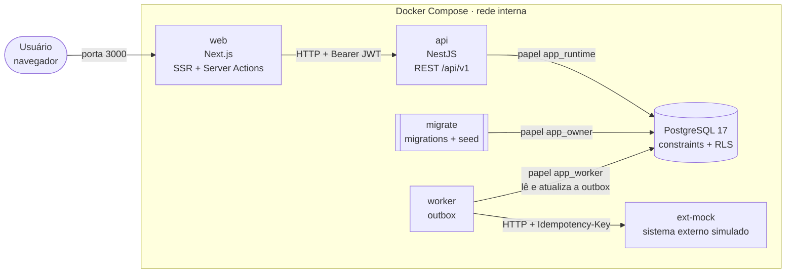
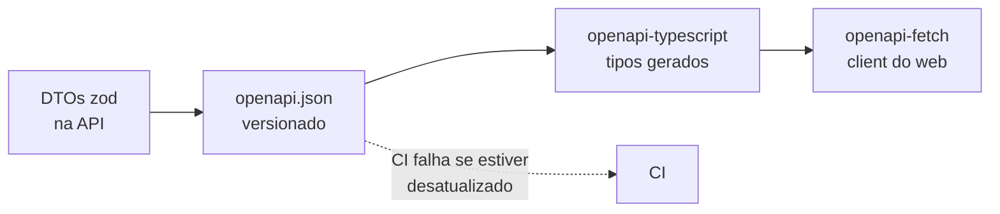
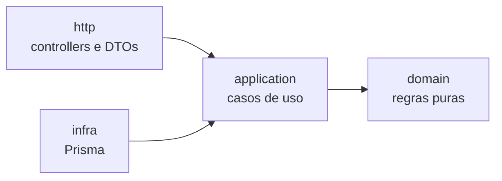
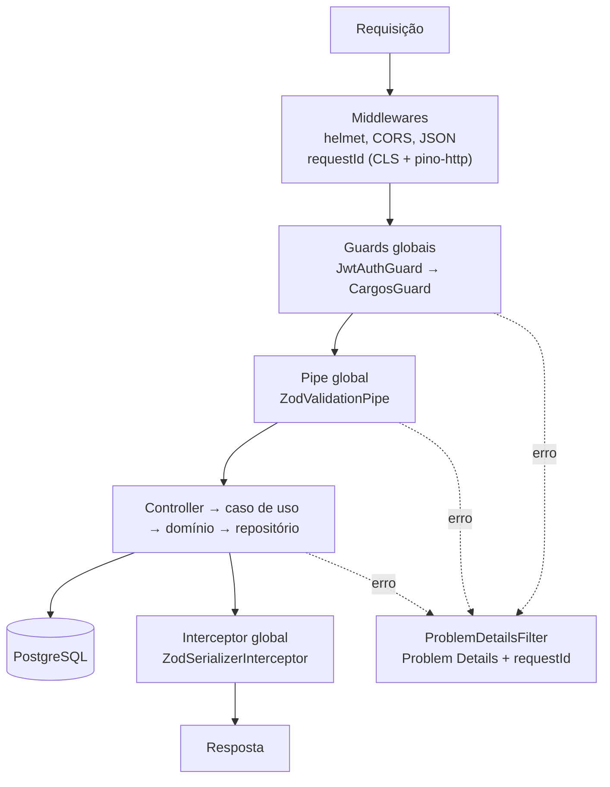
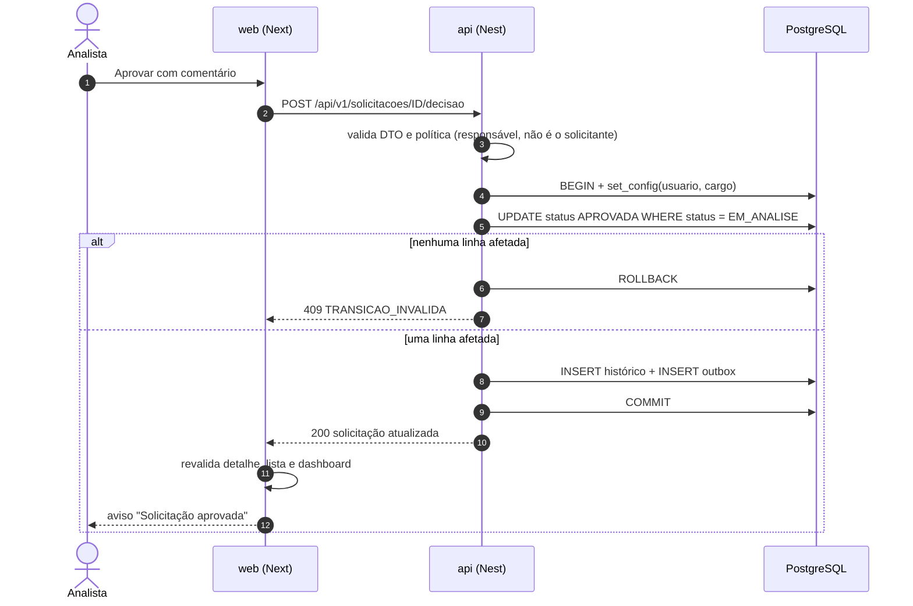

# Arquitetura

## Visão geral

O sistema roda em seis serviços no Docker Compose: a aplicação web (Next.js), a API (NestJS), o worker da outbox, o simulador do sistema externo (`ext-mock`), o PostgreSQL e um container que roda uma vez para aplicar as migrations e o seed.



### Princípios

1. **O navegador só conversa com o Next.** O Next funciona como BFF: guarda os tokens em cookies httpOnly e chama a API pelo servidor. O JavaScript do navegador nunca acessa os tokens.
2. **A API é a autoridade das regras.** A validação no front existe para a UX. Regras de negócio, permissões e transições de status são decididas na API.
3. **O banco é a última linha de defesa.** Constraints garantem integridade e a RLS garante isolamento mesmo se a API tiver um bug.
4. **A API guarda estado no banco.** Sessões e dados ficam no PostgreSQL, não em memória. A exceção é o contador do limite de tentativas de login, que fica em memória (ver [Kubernetes](kubernetes.md)).
5. **O contrato é o OpenAPI.** O spec é gerado pela API, versionado no repositório, e o front usa um client tipado gerado a partir dele (ver [decisões](decisoes.md)).
6. **Simples onde dá, rigoroso onde importa.** As camadas completas existem nos módulos com regra de negócio (`solicitacoes`, `auth`, `integracoes`). Módulos de leitura simples, como `areas`, ficam enxutos.
7. **Monólito modular.** Uma única API dividida em módulos. O worker usa o mesmo código e a mesma imagem, com outro ponto de entrada.

## Contrato OpenAPI



- **Code-first:** os DTOs da API (zod, via `nestjs-zod`) geram o OpenAPI. Não há spec escrito à mão.
- `apps/api/openapi.json` é gerado pelo script `openapi:generate` e fica versionado. Mudanças no contrato aparecem no diff.
- O web gera os tipos em `apps/web/src/lib/api/schema.d.ts` (`openapi-typescript`) e usa um client leve (`openapi-fetch`). Uma quebra de contrato vira erro de compilação no front.
- `pnpm contract:check` regenera o spec e os tipos e falha se houver diferença em relação ao que está versionado. Roda no hook de pre-push e na CI.
- O Swagger UI, em `/api/docs`, usa o mesmo documento.

## Estrutura do repositório

```text
gestao-solicitacoes-internas/
├── apps/
│   ├── api/                    # NestJS + Prisma (API e worker)
│   │   └── openapi.json        # contrato gerado e versionado
│   ├── web/                    # Next.js (App Router)
│   └── ext-mock/               # simulador do sistema externo (Node puro)
├── infra/
│   └── db/init/                # script que cria os papéis app_owner, app_runtime e app_worker
├── scripts/                    # bloqueio de arquivos sensíveis no commit
├── .github/workflows/ci.yml
├── .husky/                     # pre-commit, commit-msg, pre-push
├── compose.yaml
├── .env.example
├── package.json · pnpm-workspace.yaml · turbo.json · tsconfig.base.json
└── README.md
```

## Backend (NestJS)

```text
apps/api/
├── prisma/
│   ├── schema.prisma
│   ├── migrations/             # SQL versionado (inclui RLS, CHECKs, índices de busca e outbox)
│   ├── seed.ts
│   └── seed-solicitacoes.ts
├── docker/manifesto-imagem.mjs # dependências de cada imagem (runtime e migrate)
├── openapi.json
└── src/
    ├── main.ts                 # ponto de entrada da API
    ├── worker.ts               # ponto de entrada do worker da outbox
    ├── app.module.ts · worker.module.ts
    ├── configurar-app.ts       # helmet, CORS, prefixo, filtro de erros, Swagger
    ├── config/                 # validação zod do ambiente da API e do worker (fail fast)
    ├── common/
    │   ├── errors/             # erros de domínio, filtro global → Problem Details
    │   ├── context/            # CLS e requestId
    │   ├── guards/             # JwtAuthGuard, CargosGuard
    │   ├── decorators/         # @Public(), @Cargos(), @UsuarioAtual()
    │   ├── logging/            # nestjs-pino
    │   └── zod/
    ├── database/               # PrismaService + transação com contexto de RLS
    ├── openapi/                # geração do openapi.json
    └── modules/
        ├── auth/               # login, refresh, logout, sessão atual
        ├── solicitacoes/
        │   ├── domain/         # regras puras: máquina de estados, políticas, erros
        │   ├── application/    # casos de uso e eventos de integração
        │   ├── infra/          # repositório Prisma
        │   └── http/           # controller, DTOs, mapeamento de resposta
        ├── dashboard/          # resumo por cargo e painel de gestão
        ├── auditoria/          # verificação de integridade do histórico
        ├── areas/
        ├── health/
        └── integracoes/        # outbox: processador, backoff, cliente HTTP, heartbeat
```

Não há módulo de usuários na API. Os usuários são criados pelo seed, e a sessão atual é lida em `GET /api/v1/auth/me`.

### Regra de dependência



- `domain` não importa Nest nem Prisma. São funções e tipos puros, testados sem banco.
- `application` orquestra: carrega a solicitação, aplica a política, executa a transição e persiste.
- `infra` implementa a interface de repositório que a camada `application` define.
- Módulos simples (`areas`, `health`) ficam em controller + service, sem camadas.

### O caminho de uma requisição



1. **Middlewares:** o `X-Request-Id` recebido é aceito se for curto e sem caracteres especiais. Senão, a API gera um UUID. O mesmo id vai para o CLS, para o logger e para o header da resposta. Como roda antes dos guards, até uma requisição recusada por falta de login tem `requestId` no log.
2. **Guards:** o `JwtAuthGuard` (global) valida o token, recarrega o usuário e a sessão e grava o usuário no contexto. Usuário desativado ou sessão revogada perdem o acesso na hora. Rotas marcadas com `@Public()` passam direto. Depois, o `CargosGuard` aplica as restrições amplas por rota, como `@Cargos('ADMIN')` no painel de gestão e na auditoria. As rotas de login e refresh também passam pelo `LimiteDeTentativasGuard` (5 tentativas por minuto por e-mail ou por refresh token).
3. **Pipe:** o `ZodValidationPipe` valida body, params e query a partir dos DTOs.
4. **Controller → caso de uso:** o caso de uso abre a transação com contexto de RLS (`@Transactional()`), aplica a política de domínio e a máquina de estados, e persiste pelo repositório. Ao abrir a transação, o adaptador grava `app.usuario_id` e `app.cargo` com `set_config` local à transação.
5. **Interceptor:** o `ZodSerializerInterceptor` serializa as respostas marcadas com DTO. A latência de cada requisição é registrada pelo `pino-http`.
6. **Filtro global:** em qualquer etapa, o `ProblemDetailsFilter` converte erros de domínio, erros HTTP e erros de validação em Problem Details (`application/problem+json`). Qualquer outro erro vira 500 sem stack trace para o cliente e é registrado no log.

### Exemplo: aprovar uma solicitação



A atualização condicional (`WHERE status = EM_ANALISE`) resolve a concorrência: se outra pessoa mudou o status antes, nenhuma linha é afetada e a transação é desfeita. O evento da outbox nasce na mesma transação da aprovação, então não existe aprovação sem evento nem evento sem aprovação. As regras completas estão em [regras de negócio](regras-de-negocio.md).

### Worker da outbox

O worker (`apps/api/src/worker.ts`) é um contexto Nest sem servidor HTTP. Ele usa a mesma imagem da API com o comando `node dist/worker.js` e o papel `app_worker`, que só lê e atualiza a tabela `outbox_eventos`.

- A cada `OUTBOX_INTERVALO_MS`, envia até `OUTBOX_LOTE` eventos, um por transação.
- Os eventos são reservados com `FOR UPDATE SKIP LOCKED`, então duas réplicas não enviam o mesmo evento ao mesmo tempo.
- Cada envio é um `POST {EXT_URL}/eventos` com o id do evento no header `Idempotency-Key`. A entrega é at-least-once, e o receptor ignora reenvios da mesma chave.
- Em falha, a próxima tentativa segue backoff exponencial com jitter, limitado por `OUTBOX_BACKOFF_MAX_MS`. Depois de `OUTBOX_MAX_TENTATIVAS`, o evento fica `FALHOU` e pode ser reprocessado pelo administrador (`POST /api/v1/solicitacoes/{id}/integracao/reprocessamento`).
- Depois de cada evento e no fim de cada ciclo, grava um heartbeat em arquivo. O healthcheck do container lê esse arquivo.
- No `SIGTERM`, termina o ciclo em andamento, fecha as conexões e sai.

O `ext-mock` (`apps/ext-mock`) é um servidor Node sem dependências de produção. Ele responde 503 com a probabilidade definida em `MOCK_FAILURE_RATE`, para que as novas tentativas apareçam na demonstração.

## Frontend (Next.js)

```text
apps/web/src/
├── app/
│   ├── (auth)/login/                 # página e formulário de login, cartão de demonstração
│   ├── (app)/layout.tsx              # shell: menu, cabeçalho, sessão
│   ├── (app)/dashboard/page.tsx      # um dashboard por cargo
│   ├── (app)/solicitacoes/page.tsx   # lista com filtros
│   ├── (app)/solicitacoes/[id]/      # detalhe
│   ├── (app)/error.tsx · not-found.tsx
│   ├── api/health/route.ts           # healthcheck do container
│   ├── api/sessao/encerrar/route.ts  # apaga o access recusado pela API
│   └── layout.tsx · page.tsx · not-found.tsx
├── features/
│   ├── auth/                         # actions de login e logout, cookies, sessão
│   ├── solicitacoes/                 # actions, consultas, filtros, schemas dos formulários
│   ├── dashboard/                    # período dos indicadores
│   └── auditoria/                    # action da verificação de integridade
├── components/
│   ├── ui/                           # componentes shadcn/ui
│   ├── dashboard/                    # blocos dos dashboards
│   └── solicitacoes/                 # lista, detalhe, formulários, modais
├── lib/api/
│   ├── schema.d.ts                   # tipos gerados do OpenAPI (não editar)
│   ├── client.ts                     # openapi-fetch no servidor, com token + requestId
│   └── autenticado.ts                # usuário atual da requisição
└── proxy.ts                          # sessão e renovação do access token (Next 16)
```

### Padrões

- **Server Components** por padrão. Client Components só onde há interação (formulários, filtros, modais).
- **Server Actions** nas mutações (criar, editar, decidir, reabrir), com `revalidatePath` no fim para o detalhe, a lista e o dashboard.
- **Filtros na URL:** o link pode ser compartilhado, o botão voltar funciona e a renderização acontece no servidor.
- **Formulários** com react-hook-form + zod. Esses schemas existem só para a UX. A API continua sendo a autoridade, e os erros de campo que ela devolve aparecem no formulário.
- **Suspense com streaming:** no dashboard, o cabeçalho aparece na hora e cada bloco chega no seu `<Suspense>`, com esqueleto e estado de erro próprios.
- `loading.tsx` na lista e no detalhe de solicitações, e `error.tsx` na área logada.
- **Sem cache entre usuários:** dashboard, listas e detalhes são sempre dinâmicos, porque com RLS cada usuário vê dados diferentes. O `cache()` do React só evita repetir a mesma consulta dentro de uma renderização.
- **Renovação de sessão no `proxy.ts`:** Server Components não conseguem gravar cookies, então a troca do access token expirado acontece no proxy, antes da renderização. Detalhes em [permissões](permissoes.md).
- A UI mostra ou esconde ações com base em `acoesPermitidas`, que vem da API e usa a mesma regra que bloqueia a ação no servidor. Quem garante a segurança é a API, não a UI.

## Bibliotecas

| Camada              | Escolha                                                                                                             | Uso                                                       |
| ------------------- | ------------------------------------------------------------------------------------------------------------------- | --------------------------------------------------------- |
| Front               | Next.js 16 (App Router), React 19, TypeScript strict                                                                | SSR, Server Actions e Suspense                            |
| UI                  | Tailwind CSS 4, shadcn/ui (Radix), lucide-react, next-themes, sonner                                                | Componentes acessíveis, tema claro e escuro, avisos       |
| Formulários         | react-hook-form + zod                                                                                               | Validação de UX no próprio formulário                     |
| Client da API       | openapi-typescript + openapi-fetch                                                                                  | Tipos gerados do contrato, sem client escrito à mão       |
| Gráficos            | Recharts                                                                                                            | Distribuição por prioridade no dashboard                  |
| Back                | NestJS 11                                                                                                           | Módulos, DI, guards, pipes e interceptors                 |
| ORM                 | Prisma 7 com `@prisma/adapter-pg`                                                                                   | Migrations versionadas e tipagem forte                    |
| Banco               | PostgreSQL 17                                                                                                       | RLS, constraints, enums nativos, `unaccent` e `pg_trgm`   |
| Validação e OpenAPI | nestjs-zod + @nestjs/swagger                                                                                        | DTOs em zod validam a entrada e geram o spec              |
| Auth                | @nestjs/jwt + @node-rs/argon2                                                                                       | Access token JWT e hash de senha, sem dependência externa |
| Contexto            | nestjs-cls + @nestjs-cls/transactional                                                                              | Leva usuário, requestId e transação até o repositório     |
| Logs                | nestjs-pino                                                                                                         | JSON estruturado no stdout                                |
| Segurança           | helmet, @nestjs/throttler                                                                                           | Cabeçalhos seguros e limite de tentativas de login        |
| Testes              | Jest + Supertest + Testcontainers (api), Vitest + Testing Library (web), `node --test` (ext-mock), Playwright (E2E) | Ver [README](../README.md)                                |
| Tooling             | pnpm 10, Turborepo, ESLint, Prettier, Husky, lint-staged, commitlint                                                | Monorepo com cache e verificações locais                  |

## Preocupações transversais

| Tema           | Solução                                                                                                                                                |
| -------------- | ------------------------------------------------------------------------------------------------------------------------------------------------------ |
| Configuração   | `@nestjs/config` + schema zod. A API e o worker não sobem se faltar variável                                                                           |
| Logs           | JSON no stdout com `requestId` e latência. Header `Authorization`, cookies, senha e tokens são mascarados. Rotas de health ficam fora do log de acesso |
| Erros          | Filtro global → Problem Details. Em erro 500, o cliente não recebe stack trace                                                                         |
| Segurança HTTP | Helmet, CORS restrito à origem do web (`WEB_ORIGIN`), rate limit no login e no refresh, parser JSON com o limite padrão do Express                     |
| Saúde          | API: `/health/live` e `/health/ready` (faz `SELECT 1` no banco), fora do prefixo `/api/v1`. Web: `/api/health`. Worker: arquivo de heartbeat           |
| Documentação   | Swagger UI em `/api/docs`, a partir do mesmo documento do `openapi.json`                                                                               |
| Datas          | `timestamptz` no banco e ISO-8601 na API. Formatação pt-BR, no fuso `America/Sao_Paulo`, só na UI                                                      |
| Métricas       | Não implementadas. Os logs estruturados e o `requestId` são a base de observabilidade                                                                  |

## Docker Compose

O `compose.yaml` na raiz é o caminho de execução do sistema. Os valores padrão (`${VAR:-valor}`) deixam `docker compose up --build` funcionar sem `.env`.

### Serviços

| Serviço    | Origem                                             | Porta no host         | Depende de                                | Saúde                                                      |
| ---------- | -------------------------------------------------- | --------------------- | ----------------------------------------- | ---------------------------------------------------------- |
| `db`       | `postgres:17-alpine`                               | `5432` (ou `DB_PORT`) |                                           | `pg_isready`                                               |
| `migrate`  | `apps/api/Dockerfile`, target `migrate`            |                       | `db` saudável                             | Roda `prisma migrate deploy` e `prisma db seed`, e encerra |
| `api`      | `apps/api/Dockerfile`, target `runtime`            | `127.0.0.1:3001`      | `migrate` concluído com sucesso           | `GET /health/ready`                                        |
| `worker`   | mesma imagem da api, comando `node dist/worker.js` |                       | `migrate` concluído e `ext-mock` saudável | Heartbeat gravado há menos de 30 s                         |
| `ext-mock` | `apps/ext-mock/Dockerfile`                         | `127.0.0.1:4010`      |                                           | `GET /health`                                              |
| `web`      | `apps/web/Dockerfile`                              | `3000`                | `api` saudável                            | `GET /api/health`                                          |

- A API e o `ext-mock` ficam publicados só no loopback do host. De fora, o acesso é pelo web, que chama a API pela rede interna (`API_URL=http://api:3001`).
- Na primeira subida, o script `infra/db/init/01-papeis.sh` cria os papéis `app_owner` (dono do schema, usado por migrations e seed), `app_runtime` (API, sem bypass de RLS) e `app_worker` (worker, com acesso só à outbox). O script roda só com o volume vazio.
- `init: true` garante que o processo Node receba o `SIGTERM` e encerre direito.
- As imagens Alpine não têm `curl`. Os healthchecks usam o `fetch` do próprio Node.
- `docker compose up --wait` aceita o `migrate`, que encerra com código 0, e espera os outros serviços ficarem saudáveis. A CI usa esse comando.

### Dockerfiles

Os três Dockerfiles fazem o build a partir da raiz do repositório (`docker build -f apps/<app>/Dockerfile .`), partem de `node:24-alpine`, usam o cache do store do pnpm e rodam como usuário `node`, não root.

- **api:** `base` → `build` → `deploy` → `migrate` e `runtime`. O stage `deploy` usa `pnpm deploy --legacy --prod` duas vezes, uma para cada imagem. Antes de cada deploy, `docker/manifesto-imagem.mjs` reescreve o `package.json` só com o que aquela imagem usa. Assim o CLI do Prisma, que é peer opcional do client, não vai para o `runtime`. Do runtime do Prisma ficam só os arquivos do Postgres. As imagens finais partem de um Node sem npm, yarn e corepack, achatado numa camada só.
  - `migrate`: CLI do Prisma, `tsx` para o seed em TypeScript e `node_modules/.bin` no `PATH`.
  - `runtime`: só as dependências de produção e o `dist`. Serve à API e ao worker.
- **web:** `base` → `build` → `runtime`. Usa a saída `standalone` do Next, com `outputFileTracingRoot` na raiz do monorepo.
- **ext-mock:** `build` → `runtime`. Leva só o JavaScript compilado e o `package.json`, sem dependências.

O `.dockerignore` exclui `node_modules`, saídas de build, `.git`, `.env*` (exceto o `.env.example`) e o client gerado do Prisma.

### Variáveis

A lista completa, com comentários, está no `.env.example`. As principais:

| Variável                                                                     | Padrão local                                      | Uso                                                       |
| ---------------------------------------------------------------------------- | ------------------------------------------------- | --------------------------------------------------------- |
| `POSTGRES_PASSWORD`                                                          | `postgres-local`                                  | Superusuário do container (só no init)                    |
| `APP_OWNER_PASSWORD` · `APP_RUNTIME_PASSWORD` · `APP_WORKER_PASSWORD`        | `owner-local` · `runtime-local` · `worker-local`  | Senhas dos papéis do banco                                |
| `DB_PORT`                                                                    | `5432`                                            | Porta do Postgres no host                                 |
| `JWT_SECRET`                                                                 | valor local                                       | Assinatura dos access tokens (32+ caracteres)             |
| `ACCESS_TOKEN_TTL` · `REFRESH_TOKEN_DIAS`                                    | `15m` · `7`                                       | Validade dos tokens                                       |
| `SEED_PASSWORD`                                                              | `Demo@2026`                                       | Senha dos usuários de demonstração                        |
| `DATABASE_URL` · `MIGRATION_DATABASE_URL` · `WORKER_DATABASE_URL`            | `localhost:5432`                                  | Conexões fora do Docker                                   |
| `API_URL` · `WEB_ORIGIN`                                                     | `http://localhost:3001` · `http://localhost:3000` | Endereço da API visto pelo Next e origem aceita pelo CORS |
| `COOKIE_SECURE`                                                              | `false`                                           | `true` só atrás de HTTPS                                  |
| `DEMO_MODE`                                                                  | `false` (o compose liga)                          | Mostra os usuários de demonstração no login               |
| `EXT_URL`                                                                    | `http://localhost:4010`                           | Sistema externo que recebe os eventos                     |
| `OUTBOX_INTERVALO_MS` · `OUTBOX_LOTE` · `OUTBOX_TIMEOUT_MS`                  | `2000` · `10` · `5000`                            | Ciclo do worker                                           |
| `OUTBOX_BACKOFF_BASE_MS` · `OUTBOX_BACKOFF_MAX_MS` · `OUTBOX_MAX_TENTATIVAS` | `2000` · `60000` · `8`                            | Novas tentativas. Valores curtos para a demonstração      |
| `MOCK_FAILURE_RATE`                                                          | `0.5`                                             | Probabilidade (0 a 1) de o `ext-mock` responder 503       |

> [!NOTE]
> Em `http://localhost` não há HTTPS. Com `COOKIE_SECURE=true`, o Safari recusaria os cookies de sessão.

### Modos de execução

**Ambiente completo (um comando):**

```bash
docker compose up --build
```

Depois, abra http://localhost:3000 (aplicação) e http://localhost:3001/api/docs (Swagger). Para parar e apagar os dados: `docker compose down --volumes`.

> [!IMPORTANT]
> O papel `app_worker` é criado só na primeira subida do banco. Se o volume `db-data` já existia sem ele, recrie o volume com `docker compose down --volumes`.

**Desenvolvimento (recarga automática):**

```bash
cp .env.example .env
pnpm install
docker compose up -d db
pnpm db:migrate && pnpm db:seed
pnpm dev
```

O `pnpm dev` sobe a API (3001), o web (3000) e o `ext-mock` (4010). O worker roda à parte, depois de um build da API: `pnpm --filter api build && node apps/api/dist/worker.js`.

**E2E:** com o ambiente de pé (`docker compose up --build --wait`), `pnpm test:e2e` roda as jornadas do Playwright contra ele.

Scripts na raiz: `pnpm dev`, `pnpm build`, `pnpm test`, `pnpm test:integration`, `pnpm test:e2e`, `pnpm lint`, `pnpm typecheck`, `pnpm format`, `pnpm contract:check`, `pnpm verify` (tudo que a CI verifica, exceto o E2E), `pnpm db:migrate`, `pnpm db:seed`, `pnpm db:reset`.

Para a evolução desse desenho para um cluster, ver [Kubernetes](kubernetes.md).
