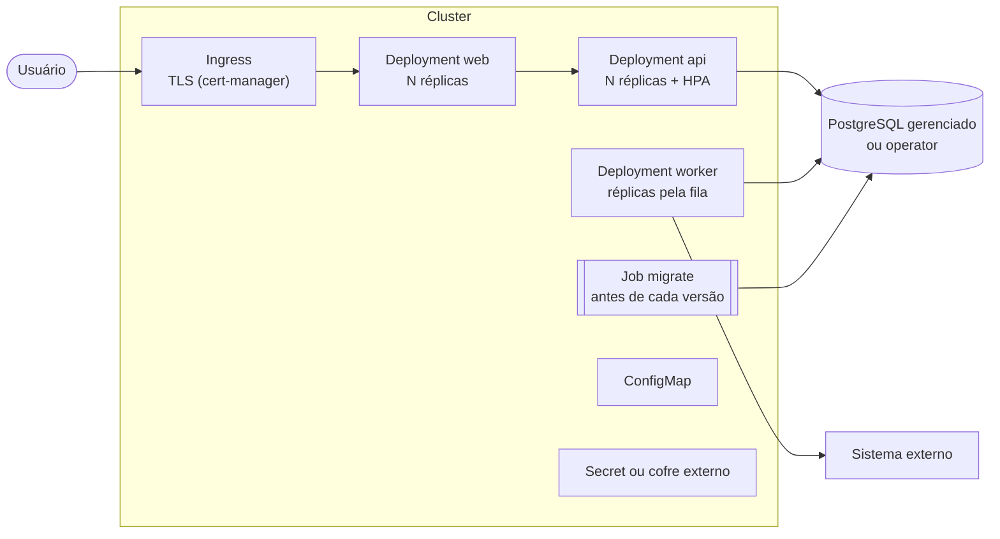

# Kubernetes

> [!IMPORTANT]
> Kubernetes não está implementado. O repositório não tem manifests, charts nem overlays. O caminho de execução é o Docker Compose, descrito em [arquitetura](arquitetura.md#docker-compose). Este documento mostra como a solução iria para um cluster, a partir do que o código já oferece.

## Por que não agora

O Docker Compose sobe o sistema inteiro com um comando e cobre o uso local, a demonstração e a CI. Um cluster acrescentaria manifests, registro de imagens e operação sem mudar o comportamento da aplicação. O desenho abaixo registra o caminho para quando houver necessidade real de escala ou de alta disponibilidade.

## O que já está pronto

A aplicação foi escrita para rodar em mais de uma réplica. Estes pontos já existem no código e não precisam mudar:

- **Imagens separadas por papel:** `web`, `api` (target `runtime`, que também serve ao worker), `migrate` e `ext-mock`, todas com usuário não-root.
- **API sem sessão em memória:** sessões e refresh tokens ficam no PostgreSQL. Qualquer réplica atende qualquer requisição.
- **Probes prontas:** `/health/live` e `/health/ready` na API (o ready testa o banco), `/api/health` no web e o arquivo de heartbeat no worker.
- **Worker que escala:** os eventos são reservados com `FOR UPDATE SKIP LOCKED`, então duas réplicas não enviam o mesmo evento. O envio é idempotente pelo `Idempotency-Key`.
- **Encerramento limpo:** API e worker tratam o `SIGTERM`. O worker termina o ciclo em andamento antes de sair.
- **Configuração por ambiente:** API e worker validam as variáveis na subida e não sobem se faltar alguma.
- **Papéis de banco separados:** `app_owner`, `app_runtime` e `app_worker`, cada um com uma URL de conexão própria.

## Desenho

## Componentes

- **Deployments** para `web`, `api` e `worker`. API e web rodam com várias réplicas e rolling update sem indisponibilidade (`maxUnavailable: 0`).
- **Probes:** na API, `readinessProbe` em `/health/ready` e `livenessProbe` em `/health/live`. No web, `/api/health`. No worker, uma probe `exec` que lê o arquivo de heartbeat, como o healthcheck do Compose faz hoje.
- **HPA** escalando a API por CPU. O worker escala separado, conforme o volume de eventos pendentes na outbox.
- **Migrations** num `Job` com a imagem `migrate`, executado antes da nova versão da API. Nos ambientes reais, o Job roda só `prisma migrate deploy`, sem o seed de demonstração.
- **Configuração** em `ConfigMap` e segredos (`JWT_SECRET`, senhas dos papéis) em `Secret` ou num cofre externo, como Vault ou Azure Key Vault.
- **NetworkPolicy:** só o Ingress fala com o web, só o web fala com a API, só a API, o worker e o Job de migrations falam com o banco, e só o worker sai para o sistema externo.
- **Ingress** com TLS (cert-manager) na frente do web. Com HTTPS, `COOKIE_SECURE=true`.
- **Banco fora do cluster:** serviço gerenciado (RDS, Cloud SQL, Azure Database for PostgreSQL) ou um operator como CloudNativePG, com failover e backups. Os papéis criados hoje por `infra/db/init/01-papeis.sh` passam a ser criados no provisionamento do banco.
- **Entrega:** Helm ou Kustomize, com GitOps (Argo CD) num estágio mais maduro.
- O `ext-mock` não vai para o cluster. Em produção, `EXT_URL` aponta para o sistema real.

## O que muda no código

> [!NOTE]
> O limite de tentativas de login e de refresh (`@nestjs/throttler`) guarda o contador em memória, por réplica. Com várias réplicas da API, o armazenamento do throttler passa para um store compartilhado, como Redis.

- Os valores de backoff do Compose são curtos, para a demonstração. Em produção, `OUTBOX_BACKOFF_BASE_MS` e `OUTBOX_BACKOFF_MAX_MS` sobem para algo como 30 s e 2 h.
- O `trust proxy` da API aceita `X-Forwarded-For` de loopback e de redes internas. No cluster, a faixa de rede dos pods precisa estar coberta.
