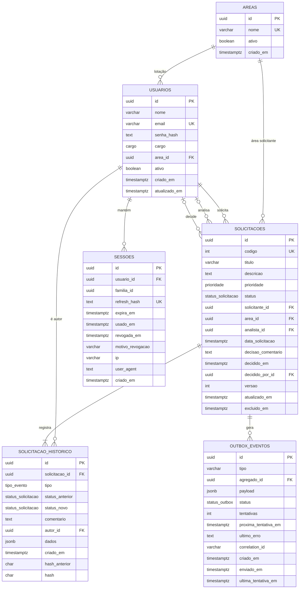

# Modelo de dados

O banco é PostgreSQL 17. O schema fica em `apps/api/prisma/schema.prisma` e as migrations em `apps/api/prisma/migrations`. O que o Prisma não representa (CHECKs, RLS, permissões dos papéis, extensões, funções, trigger e o índice de busca sem acento) está em SQL escrito à mão dentro das próprias migrations.

As regras de negócio que essas estruturas protegem estão em [regras-de-negocio.md](regras-de-negocio.md). Os cargos e o que cada um pode fazer estão em [permissoes.md](permissoes.md).

## Diagrama

Todas as chaves estrangeiras usam `ON DELETE RESTRICT`. Nada é apagado fisicamente.

## Enums

| Enum                 | Valores                                                                                  | Rótulo na interface                     |
| -------------------- | ---------------------------------------------------------------------------------------- | --------------------------------------- |
| `cargo`              | `SOLICITANTE`, `ANALISTA`, `ADMIN`                                                       | Solicitante, Analista, Administrador    |
| `prioridade`         | `BAIXA`, `MEDIA`, `ALTA`                                                                 | Baixa, Média, Alta                      |
| `status_solicitacao` | `ABERTA`, `EM_ANALISE`, `APROVADA`, `REJEITADA`                                          | Aberta, Em análise, Aprovada, Rejeitada |
| `tipo_evento`        | `CRIADA`, `EDITADA`, `ANALISE_INICIADA`, `APROVADA`, `REJEITADA`, `REABERTA`, `EXCLUIDA` | Linha do tempo                          |
| `status_outbox`      | `PENDENTE`, `ENVIADO`, `FALHOU`                                                          | Status da integração                    |

O banco guarda os valores técnicos, sem acento. Os rótulos em português ficam só no front. Um valor novo entra com `ALTER TYPE ... ADD VALUE`.

## Tabelas

### `solicitacoes`

| Coluna               | Tipo                   | Regra                                                                          |
| -------------------- | ---------------------- | ------------------------------------------------------------------------------ |
| `id`                 | `uuid` PK              | `gen_random_uuid()`                                                            |
| `codigo`             | `integer`              | sequencial, `UNIQUE`. Exibido como `SOL-000042`                                |
| `titulo`             | `varchar(120)`         | pelo menos 5 caracteres sem contar espaços nas pontas                          |
| `descricao`          | `text`                 | até 5000 caracteres, com pelo menos 10 que não sejam espaço                    |
| `prioridade`         | `prioridade`           | obrigatória                                                                    |
| `status`             | `status_solicitacao`   | `DEFAULT 'ABERTA'`                                                             |
| `solicitante_id`     | `uuid` FK → `usuarios` | obrigatório                                                                    |
| `area_id`            | `uuid` FK → `areas`    | obrigatório                                                                    |
| `analista_id`        | `uuid` FK → `usuarios` | nulo até a análise começar. Volta a nulo numa reabertura                       |
| `data_solicitacao`   | `timestamptz(3)`       | `DEFAULT now()`                                                                |
| `decisao_comentario` | `text`                 | nulo enquanto não houver decisão                                               |
| `decidido_em`        | `timestamptz(3)`       | idem                                                                           |
| `decidido_por_id`    | `uuid` FK → `usuarios` | idem                                                                           |
| `versao`             | `integer`              | `DEFAULT 1`. Incrementada a cada alteração (controle de concorrência otimista) |
| `atualizado_em`      | `timestamptz(3)`       | atualizado pelo Prisma a cada escrita                                          |
| `excluido_em`        | `timestamptz(3)`       | nulo enquanto ativa. Exclusão é lógica                                         |

> [!NOTE]
> A solicitação guarda só a decisão vigente. Na reabertura, os campos de decisão e o analista são limpos, e a decisão anterior fica no evento `REABERTA` do histórico (em `dados`: resultado, comentário, autor e data). Assim as constraints abaixo valem sem exceção.

**Constraints.** O banco recusa estados impossíveis mesmo que a API tenha um bug.

| Constraint                           | Regra                                                                                                                                    |
| ------------------------------------ | ---------------------------------------------------------------------------------------------------------------------------------------- |
| `chk_solicitacoes_titulo`            | `char_length(btrim(titulo)) >= 5`                                                                                                        |
| `chk_solicitacoes_descricao`         | `char_length(descricao) <= 5000` e pelo menos 10 caracteres fora `\s`                                                                    |
| `chk_solicitacoes_decisao_completa`  | status final (`APROVADA` ou `REJEITADA`) se, e somente se, `decidido_em`, `decisao_comentario` e `decidido_por_id` estiverem preenchidos |
| `chk_solicitacoes_analista_definido` | `status = 'ABERTA'` ou `analista_id` preenchido                                                                                          |
| `chk_solicitacoes_segregacao`        | `analista_id` e `decidido_por_id` diferentes de `solicitante_id` (ninguém analisa nem decide a própria solicitação)                      |

**Índices.**

| Índice                                                                                         | Colunas                                                                   | Uso                                     |
| ---------------------------------------------------------------------------------------------- | ------------------------------------------------------------------------- | --------------------------------------- |
| `solicitacoes_codigo_key`                                                                      | `codigo` (único)                                                          | busca por código                        |
| `solicitacoes_data_solicitacao_idx`                                                            | `data_solicitacao DESC`                                                   | listagem padrão, mais recentes primeiro |
| `solicitacoes_solicitante_id_data_solicitacao_idx`                                             | `solicitante_id, data_solicitacao DESC`                                   | "minhas solicitações"                   |
| `solicitacoes_status_data_solicitacao_idx`                                                     | `status, data_solicitacao`                                                | fila de análise                         |
| `solicitacoes_area_id_idx`, `solicitacoes_analista_id_idx`, `solicitacoes_decidido_por_id_idx` | chaves estrangeiras                                                       | o Postgres não indexa FK sozinho        |
| `idx_solicitacoes_busca`                                                                       | GIN trigram sobre `app.sem_acento(lower(titulo \|\| ' ' \|\| descricao))` | busca sem acento                        |

Com o volume atual, o Postgres tende a preferir varredura sequencial. Os índices estão pensados para quando o volume crescer.

### Busca sem acento

- Extensões `unaccent` e `pg_trgm`, ambas _trusted_: o dono do banco (`app_owner`) as cria sem superusuário.
- `unaccent()` é `STABLE`, e um índice exige função `IMMUTABLE`. O wrapper `app.sem_acento(text)` fixa o dicionário (`public.unaccent`), o que torna seguro marcá-lo como `IMMUTABLE`.
- A consulta compara `app.sem_acento(lower(titulo || ' ' || descricao))` com `LIKE '%termo%'` aplicado ao termo também normalizado. Assim "solicitacao" encontra "Solicitação".
- Se o termo for um código (`SOL-000042` ou `42`), a busca também compara com `codigo`.

### `solicitacao_historico`

Append-only: o papel da API tem só `SELECT` e `INSERT`. Não há `UPDATE` nem `DELETE`.

| Coluna                           | Tipo                       | Regra                                                                               |
| -------------------------------- | -------------------------- | ----------------------------------------------------------------------------------- |
| `id`                             | `uuid` PK                  | `gen_random_uuid()`                                                                 |
| `solicitacao_id`                 | `uuid` FK → `solicitacoes` | obrigatório                                                                         |
| `tipo`                           | `tipo_evento`              | obrigatório                                                                         |
| `status_anterior`, `status_novo` | `status_solicitacao`       | nulos quando o evento não muda status (ex.: `EDITADA`)                              |
| `comentario`                     | `text`                     | obrigatório em `APROVADA`, `REJEITADA` e `REABERTA`                                 |
| `autor_id`                       | `uuid` FK → `usuarios`     | obrigatório                                                                         |
| `dados`                          | `jsonb`                    | campos alterados numa edição (antes e depois) ou a decisão desfeita numa reabertura |
| `criado_em`                      | `timestamptz(6)`           | `DEFAULT clock_timestamp()`                                                         |
| `hash_anterior`                  | `char(64)`                 | hash do evento anterior da mesma solicitação. Calculado pelo trigger                |
| `hash`                           | `char(64)`                 | hash deste evento. Calculado pelo trigger                                           |

- `criado_em` usa `clock_timestamp()`, a hora real do `INSERT`, e não `now()`, que é o início da transação. Em requisições concorrentes, a linha do tempo segue a ordem em que os eventos foram gravados. A precisão de microssegundos evita empate entre eventos do mesmo milissegundo.
- Constraint `chk_historico_comentario`: `tipo NOT IN ('APROVADA', 'REJEITADA', 'REABERTA') OR comentario IS NOT NULL`.
- Índices: `(solicitacao_id, criado_em)` para a linha do tempo, `(autor_id)` e `(tipo, criado_em)` para o painel de gestão (eventos de um tipo num período).

#### Hash encadeado

Cada solicitação tem a própria corrente de hash. O GRANT já impede que a API altere ou apague eventos. A corrente acrescenta detecção: uma alteração ou remoção feita por quem tem acesso mais alto ao banco deixa de conferir no recálculo.

- O trigger `encadear_historico` (`BEFORE INSERT`) chama `app.encadear_historico()`. Ele lê o `hash` do último evento da mesma solicitação, na ordem `(criado_em, id)`, e grava em `hash_anterior`. O primeiro evento parte da semente fixa de 64 zeros.
- `hash = sha256(hash_anterior || '|' || conteúdo canônico)`, em hexadecimal minúsculo (`app.hash_do_evento`).
- O conteúdo canônico (`app.conteudo_canonico_historico`) junta, separados por `|` e com `NULL` como texto vazio: `solicitacao_id`, `tipo`, `status_anterior`, `status_novo`, `autor_id`, `comentario`, `dados::text` e `criado_em` em UTC com microssegundos (`YYYY-MM-DDTHH24:MI:SS.USZ`).
- Quem insere não escolhe os valores: o trigger sobrescreve os dois. O default de 64 zeros existe só para o Prisma não exigir os campos no `create`.
- A função do trigger é `SECURITY DEFINER` (dono `app_owner`, fora da RLS), para ler o evento anterior independentemente da visibilidade de quem insere. Tem `search_path` fixo e `EXECUTE` revogado de `PUBLIC`.
- O `app_runtime` pode executar as funções do conteúdo canônico e do hash. O endpoint `GET /auditoria/integridade`, restrito ao administrador, recalcula a corrente e aponta as divergências.

### `usuarios`

| Coluna                       | Tipo                | Regra                                                          |
| ---------------------------- | ------------------- | -------------------------------------------------------------- |
| `id`                         | `uuid` PK           | `gen_random_uuid()`                                            |
| `nome`                       | `varchar(120)`      | obrigatório                                                    |
| `email`                      | `varchar(254)`      | `UNIQUE`. `chk_usuarios_email_minusculo`: sempre em minúsculas |
| `senha_hash`                 | `text`              | argon2id                                                       |
| `cargo`                      | `cargo`             | um cargo por usuário                                           |
| `area_id`                    | `uuid` FK → `areas` | obrigatório. Índice `(area_id)`                                |
| `ativo`                      | `boolean`           | `DEFAULT true`. Usuário não é apagado, só desativado           |
| `criado_em`, `atualizado_em` | `timestamptz(3)`    |                                                                |

### `sessoes`

Guarda as sessões de refresh token. Cada login abre uma família. Cada renovação marca o token usado e cria a próxima sessão da mesma família.

| Coluna                            | Regra                                                                                                                          |
| --------------------------------- | ------------------------------------------------------------------------------------------------------------------------------ |
| `id`                              | `uuid` PK                                                                                                                      |
| `usuario_id`                      | FK → `usuarios`, obrigatório                                                                                                   |
| `familia_id`                      | identifica todas as rotações de um mesmo login                                                                                 |
| `refresh_hash`                    | SHA-256 do token, `UNIQUE`. O token nunca é gravado. SHA-256 basta porque o token é aleatório e longo. Argon2 fica para senhas |
| `expira_em`                       | 7 dias após a emissão (configurável)                                                                                           |
| `usado_em`                        | quando o token foi trocado por um novo                                                                                         |
| `revogada_em`, `motivo_revogacao` | logout, reuso detectado, usuário desativado                                                                                    |
| `ip`, `user_agent`                | auditoria do acesso                                                                                                            |
| `criado_em`                       |                                                                                                                                |

- Se chegar um token já usado, a família inteira é revogada, porque isso indica roubo.
- Índices: `(usuario_id)` e `(familia_id)`.
- Sem RLS: a renovação acontece antes de existir contexto de usuário. O acesso é controlado pelo módulo `auth`.

### `areas`

`id`, `nome` (único, `varchar(80)`), `ativo` e `criado_em`. O seed cria Tecnologia, Financeiro, Recursos Humanos, Jurídico, Comercial e Operações.

### `outbox_eventos`

Implementa o Transactional Outbox (ver [ADR-010](decisoes.md#adr-010)). A API grava o evento na mesma transação da mudança de status, e o worker o entrega ao sistema externo.

| Coluna                 | Regra                                                                                                            |
| ---------------------- | ---------------------------------------------------------------------------------------------------------------- |
| `id`                   | `uuid` PK, gerado pela API. Também é a chave de idempotência da chamada externa                                  |
| `tipo`                 | `varchar(60)`: `SolicitacaoAprovada` ou `SolicitacaoReaberta`                                                    |
| `agregado_id`          | FK → `solicitacoes`                                                                                              |
| `payload`              | `jsonb` com o contrato do evento                                                                                 |
| `status`               | `PENDENTE`, depois `ENVIADO` ou `FALHOU`                                                                         |
| `tentativas`           | `DEFAULT 0`                                                                                                      |
| `proxima_tentativa_em` | `timestamptz(6)`, `DEFAULT clock_timestamp()`. Controla o retry com backoff                                      |
| `ultimo_erro`          | erro da última tentativa                                                                                         |
| `correlation_id`       | `varchar(100)`: `requestId` da requisição que gerou o evento                                                     |
| `criado_em`            | `timestamptz(6)`, `DEFAULT clock_timestamp()`: a ordem de envio por solicitação segue a ordem real das gravações |
| `enviado_em`           | preenchido na entrega                                                                                            |
| `ultima_tentativa_em`  | gravada pelo worker a cada tentativa, junto com o desfecho                                                       |

**Constraints.**

| Constraint                      | Regra                                                          |
| ------------------------------- | -------------------------------------------------------------- |
| `chk_outbox_eventos_tipo`       | `tipo IN ('SolicitacaoAprovada', 'SolicitacaoReaberta')`       |
| `chk_outbox_eventos_tentativas` | `tentativas >= 0`                                              |
| `chk_outbox_eventos_enviado_em` | `enviado_em` preenchido se, e somente se, `status = 'ENVIADO'` |

**Índices.** `(status, proxima_tentativa_em)` para o worker achar o próximo evento pronto, e `(agregado_id, criado_em)` para a ordem por solicitação e o detalhe.

O worker trava o evento com `SELECT ... FOR UPDATE SKIP LOCKED`. Várias réplicas podem rodar ao mesmo tempo sem enviar o mesmo evento duas vezes. Ao atingir `OUTBOX_MAX_TENTATIVAS` (padrão 8), o evento vai para `FALHOU`, e o administrador pode devolvê-lo à fila. Cada tentativa também fica nos logs estruturados.

## Papéis do banco

Os papéis são criados por `infra/db/init/01-papeis.sh`, que roda na primeira subida do container do Postgres. As migrations aplicam os `GRANT`s.

| Papel         | Uso                                               | Atributos                                                                       |
| ------------- | ------------------------------------------------- | ------------------------------------------------------------------------------- |
| `app_owner`   | dono do banco e do schema. Roda migrations e seed | `LOGIN CREATEDB` (o `CREATEDB` serve à shadow database do `prisma migrate dev`) |
| `app_runtime` | API                                               | `NOSUPERUSER NOCREATEDB NOCREATEROLE NOBYPASSRLS`                               |
| `app_worker`  | worker da outbox                                  | `NOSUPERUSER NOCREATEDB NOCREATEROLE NOBYPASSRLS`                               |

`CONNECT` no banco é revogado de `PUBLIC` e concedido só aos três papéis.

### Permissões do `app_runtime`

| Objeto                              | Permissões                                                                                                                                                                                                                                                        |
| ----------------------------------- | ----------------------------------------------------------------------------------------------------------------------------------------------------------------------------------------------------------------------------------------------------------------- |
| `areas`                             | `SELECT`                                                                                                                                                                                                                                                          |
| `usuarios`                          | `SELECT`                                                                                                                                                                                                                                                          |
| `solicitacoes`                      | `SELECT`, `INSERT`, `UPDATE`. Sem `DELETE`: exclusão é lógica                                                                                                                                                                                                     |
| sequência `solicitacoes_codigo_seq` | `USAGE`, `SELECT`                                                                                                                                                                                                                                                 |
| `solicitacao_historico`             | `SELECT`, `INSERT` (append-only)                                                                                                                                                                                                                                  |
| `sessoes`                           | `SELECT`, `INSERT`, `UPDATE`                                                                                                                                                                                                                                      |
| `outbox_eventos`                    | `INSERT`. `SELECT` só nas colunas `id`, `tipo`, `agregado_id`, `status`, `tentativas`, `proxima_tentativa_em`, `criado_em`, `enviado_em`, `ultimo_erro` e `ultima_tentativa_em`. `UPDATE` só em `status`, `tentativas` e `proxima_tentativa_em` (reprocessamento) |
| schema `app`                        | `USAGE` e `EXECUTE` em `usuario_atual()`, `cargo_atual()`, `sem_acento(text)`, `conteudo_canonico_historico(...)` e `hash_do_evento(text, text)`                                                                                                                  |
| `_prisma_migrations`                | nenhuma                                                                                                                                                                                                                                                           |

O `payload` e o `correlation_id` da outbox ficam só com o worker. Como a API não tem `SELECT` em todas as colunas, ela insere eventos sem `RETURNING`. Só o endpoint do painel de gestão, restrito ao administrador, seleciona `ultimo_erro`.

### Permissões do `app_worker`

`SELECT` e `UPDATE` em `outbox_eventos`, e nada mais. O worker não cria nem apaga eventos.

## Row Level Security

A RLS é a segunda barreira de visibilidade. A primeira é o filtro do repositório na API (ver [ADR-005](decisoes.md#adr-005) e [permissoes.md](permissoes.md)).

- Em cada transação, a API grava o usuário e o cargo com `set_config('app.usuario_id', ..., true)` e `set_config('app.cargo', ..., true)`, que valem só para aquela transação.
- As funções `app.usuario_atual()` e `app.cargo_atual()` leem esses valores. Sem contexto, devolvem `NULL`, as políticas dão falso e nenhuma linha aparece: na dúvida, o banco nega.
- Sem `FORCE`: o dono das tabelas (`app_owner`) fica fora da RLS para rodar migrations e seed.

| Tabela                  | Política              | Regra                                                                                                                              |
| ----------------------- | --------------------- | ---------------------------------------------------------------------------------------------------------------------------------- |
| `solicitacoes`          | `solicitacoes_select` | analista e administrador veem todas. O solicitante vê só as próprias                                                               |
|                         | `solicitacoes_insert` | `solicitante_id` é o usuário atual e `status = 'ABERTA'`                                                                           |
|                         | `solicitacoes_update` | analista e administrador alteram qualquer uma. O solicitante altera só a própria enquanto `ABERTA`, e ela continua `ABERTA` depois |
| `solicitacao_historico` | `historico_select`    | herda a visibilidade da solicitação (subconsulta em `solicitacoes`, onde a RLS também vale)                                        |
|                         | `historico_insert`    | `autor_id` é o usuário atual                                                                                                       |
| `outbox_eventos`        | `outbox_select`       | herda a visibilidade da solicitação                                                                                                |
|                         | `outbox_insert`       | só analista e administrador (aprovação e reabertura)                                                                               |
|                         | `outbox_update`       | só o administrador (reprocessamento)                                                                                               |
|                         | `outbox_worker`       | `app_worker` processa a fila inteira, sem contexto de usuário                                                                      |

Não há política de `DELETE` em nenhuma tabela. O filtro `excluido_em IS NULL` fica no repositório e não na política: num `UPDATE ... RETURNING`, a linha nova também precisa passar pela política de `SELECT`, e a exclusão lógica deixaria de funcionar.

`areas`, `usuarios` e `sessoes` não têm RLS.

## Convenções

- Tabelas em `snake_case` no plural. Models do Prisma em `PascalCase` no singular, com `@@map` e `@map`.
- Toda data é `timestamptz`, gravada em UTC.
- Chaves `uuid`, para não expor sequência nem volume nas URLs. O `codigo` legível serve só para exibição e busca.
- Nada é apagado fisicamente: solicitações usam `excluido_em` e usuários usam `ativo`.

## Migrations e seed

- Prisma Migrate: cada migration é um arquivo SQL versionado em `apps/api/prisma/migrations`.
- O SQL escrito à mão entra em migrations criadas com `prisma migrate dev --create-only` e editadas antes de aplicar. Cada bloco manual é marcado com um comentário "Escrito à mão".
- Seed (`prisma/seed.ts`, idempotente):
  - 6 áreas;
  - 6 usuários de demonstração: 1 administrador, 2 analistas e 3 solicitantes de áreas diferentes. A senha vem de `SEED_PASSWORD`;
  - 40 solicitações espalhadas nos últimos 60 dias, com todos os status e prioridades, algumas reabertas, e histórico coerente com o status atual.
- Comandos na raiz: `pnpm db:migrate`, `pnpm db:seed` e `pnpm db:reset`.

Para a execução com Docker Compose, veja [../README.md](../README.md). A visão geral dos componentes está em [arquitetura.md](arquitetura.md).
