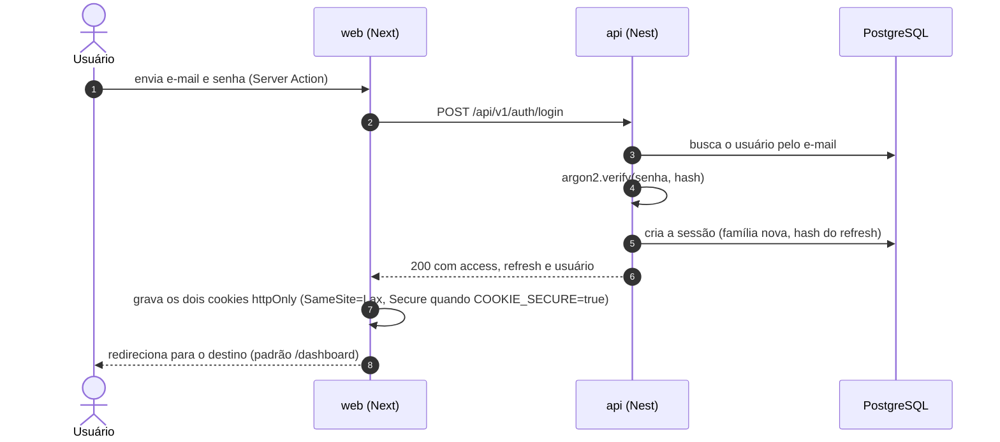
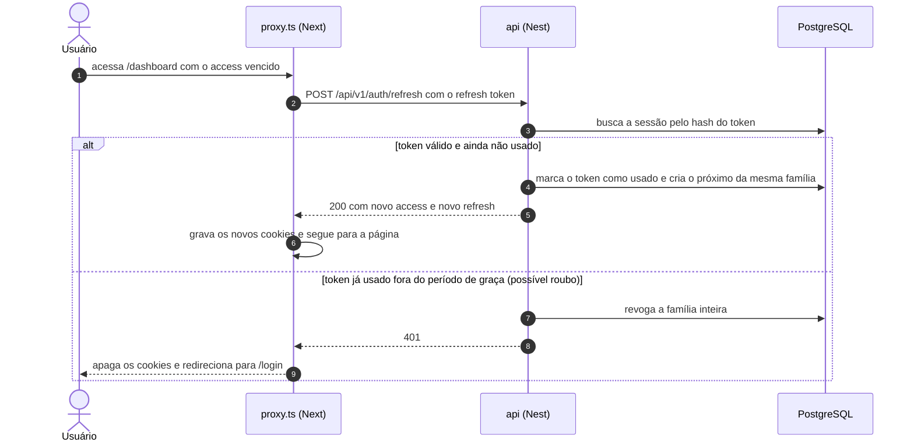
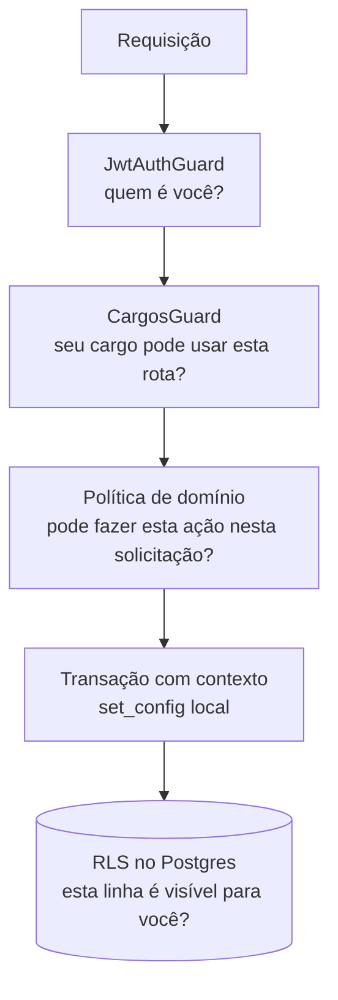

# Usuários, cargos e permissões

Este documento descreve os cargos, o que cada um pode fazer, como a autenticação funciona e como a autorização é aplicada na API e no banco. As regras de negócio citadas (RN-xx) estão em [regras-de-negocio.md](regras-de-negocio.md).

## Cargos

| Cargo         | Quem é                          | O que faz                                                                                                                                                                                        |
| ------------- | ------------------------------- | ------------------------------------------------------------------------------------------------------------------------------------------------------------------------------------------------ |
| `SOLICITANTE` | Qualquer colaborador            | Abre e acompanha as próprias solicitações                                                                                                                                                        |
| `ANALISTA`    | Time que avalia as solicitações | Vê todas, inicia a análise e decide. Também abre solicitações, mas não analisa nem decide as próprias                                                                                            |
| `ADMIN`       | Gestão do sistema               | Tudo que o analista faz, mais editar e excluir solicitações ainda sem decisão, **reabrir** as decididas, reprocessar a integração, ver o painel de gestão e verificar a integridade do histórico |

Não existe gestão de usuários pela aplicação. Usuários e áreas vêm do seed.

### Usuários de demonstração

| Nome         | Cargo       | Área             |
| ------------ | ----------- | ---------------- |
| Ana Souza    | Solicitante | Financeiro       |
| Bruno Lima   | Solicitante | Recursos Humanos |
| Camila Rocha | Solicitante | Comercial        |
| Carla Mendes | Analista    | Tecnologia       |
| Rafael Costa | Analista    | Tecnologia       |
| Diego Alves  | Admin       | Tecnologia       |

E-mails e senha estão em [Usuários de demonstração](../README.md#usuários-de-demonstração).

## Matriz de permissões

| Ação                                  | Solicitante         | Analista                                   | Admin                                |
| ------------------------------------- | ------------------- | ------------------------------------------ | ------------------------------------ |
| Fazer login e ver o próprio perfil    | Sim                 | Sim                                        | Sim                                  |
| Criar solicitação                     | Sim                 | Sim                                        | Sim                                  |
| Ver solicitações                      | Só as próprias      | Todas                                      | Todas                                |
| Editar título, descrição e prioridade | Própria e `ABERTA`  | Própria e `ABERTA`                         | Qualquer uma sem decisão             |
| Excluir (lógico)                      | Própria e `ABERTA`  | Própria e `ABERTA`                         | Qualquer uma sem decisão             |
| Iniciar análise                       | Não                 | `ABERTA` e de outra pessoa                 | `ABERTA` e de outra pessoa           |
| Aprovar ou rejeitar                   | Não                 | Responsável, `EM_ANALISE`, de outra pessoa | `EM_ANALISE`, de outra pessoa        |
| Reabrir uma decidida                  | Não                 | Não                                        | Com justificativa, de outra pessoa   |
| Reprocessar a integração              | Não                 | Não                                        | Quando a integração está em `FALHOU` |
| Ver histórico                         | Das próprias        | Todas                                      | Todas                                |
| Dashboard                             | Escopo das próprias | Visão geral                                | Visão geral                          |
| Painel de gestão                      | Não                 | Não                                        | Sim                                  |
| Verificar integridade do histórico    | Não                 | Não                                        | Sim                                  |

A matriz das ações sobre uma solicitação fica num único lugar, `verificarAcao()` e `acoesPermitidas()` em `apps/api/src/modules/solicitacoes/domain/politicas.ts`. A RLS repete a parte de visibilidade como segunda barreira.

## Autenticação

A autenticação é própria: access token curto, refresh token rotativo e sessão persistida no banco ([ADR-004](decisoes.md#adr-004)).

| Token   | Formato                                       | Validade                                                         | Onde fica                                                                                                                                    |
| ------- | --------------------------------------------- | ---------------------------------------------------------------- | -------------------------------------------------------------------------------------------------------------------------------------------- |
| Access  | JWT HS256 (`sub`, `cargo`, `areaId`, `sid`)   | 15 minutos (`ACCESS_TOKEN_TTL`)                                  | Cookie httpOnly `sessao_access`, gravado pelo Next                                                                                           |
| Refresh | Valor aleatório opaco de 256 bits (base64url) | 7 dias (`REFRESH_TOKEN_DIAS`), contados de novo a cada renovação | Cookie httpOnly `sessao_refresh`, gravado pelo Next. No banco, só o SHA-256 (tabela `sessoes`, ver [modelo-de-dados.md](modelo-de-dados.md)) |

O JavaScript da página não lê os tokens (cookies httpOnly). O servidor do Next lê o cookie e envia o access à API no cabeçalho `Authorization: Bearer`.

### Login



### Renovação da sessão

Server Components não conseguem gravar cookies. Por isso a renovação acontece no `apps/web/src/proxy.ts`, que roda antes da renderização e pode gravar cookies na resposta. O proxy renova quando o access está ausente ou a menos de 10 segundos de vencer.



Destinos de um refresh token (`apps/api/src/modules/auth/domain/rotacao.ts`):

| Situação                                            | Resultado                                                       |
| --------------------------------------------------- | --------------------------------------------------------------- |
| Válido e ainda não usado                            | Rotaciona: marca como usado e emite o próximo par da família    |
| Usado há até 10 segundos (`REFRESH_GRACA_SEGUNDOS`) | Período de graça: emite outro par na mesma família, sem revogar |
| Usado há mais tempo                                 | Reuso: revoga a família inteira e responde 401                  |
| Expirado ou revogado, ou usuário inativo            | 401                                                             |

O período de graça cobre duas requisições quase simultâneas (duas abas, por exemplo) que renovam com o mesmo refresh. Devolver o mesmo par exigiria guardar o refresh novo de forma recuperável, e o banco só guarda o hash. Por isso a graça emite outro par.

Só o 401 encerra a sessão no proxy. Uma falha passageira (429, 5xx, rede, tempo esgotado) mantém os cookies e leva ao login; a próxima navegação tenta renovar de novo.

### Regras da sessão

- A cada requisição, o `JwtAuthGuard` confere a assinatura e a validade do access, recarrega o usuário pelo `sub` e confere se a sessão (`sid`) existe e não foi revogada. Um usuário inativo ou uma sessão revogada perdem o acesso na hora (RN-15). O cargo e a área usados na requisição são os do banco, não os do token.
- **Logout:** uma Server Action chama `POST /api/v1/auth/logout`, que revoga a família inteira da sessão, e apaga os cookies. Se a chamada falhar, os cookies são apagados mesmo assim.
- **Access recusado pela API:** quando a API responde 401 a um access que ainda parece válido, a rota `/api/sessao/encerrar` apaga só o cookie do access e volta para `/dashboard`. Lá o proxy tenta o refresh e decide.
- **Cookie `Secure`:** controlado por `COOKIE_SECURE` no web. No Compose o padrão é `false`, porque a aplicação roda em `http://localhost` e o Safari recusa cookie `Secure` sem HTTPS. Atrás de HTTPS, use `true`.
- O proxy manda para `/login` quem não tem sessão. **Quem valida de verdade é a API.**
- O `?next=` do login só aceita caminhos internos: começa com `/`, mas não com `//` nem `/\`, e não tem caracteres de controle. Assim não vira open redirect.

### Proteções do login

- Senhas com hash **argon2id**.
- Mensagem genérica "E-mail ou senha inválidos." para e-mail inexistente, senha errada ou usuário inativo, para não revelar quais e-mails existem. Quando o e-mail não existe, a API verifica um hash fictício, para o tempo de resposta ser parecido.
- Rate limit (`@nestjs/throttler`): **5 tentativas de login por minuto por e-mail** e **5 renovações por minuto por refresh token**. Acima disso, 429 `MUITAS_TENTATIVAS`. A chave não usa o IP, porque o `X-Forwarded-For` é informado pelo cliente e pode ser forjado. Efeito colateral aceito: 5 tentativas bloqueiam o login daquela conta por 1 minuto. O contador fica em memória (uma réplica).
- O IP gravado na sessão serve só para auditoria. A porta da API fica publicada só em `127.0.0.1`.
- O log registra a tentativa de login sem a senha. O `nestjs-pino` mascara `authorization`, cookies, `senha`, `accessToken` e `refreshToken`.
- **CSRF:** as Server Actions do Next comparam `Origin` e `Host`. Junto com `SameSite=Lax`, isso cobre as mutações, que passam todas por Server Actions.

> [!NOTE]
> A autenticação é própria para tudo rodar localmente com o próprio Postgres, sem provedor de identidade externo. A evolução natural é SSO corporativo via OIDC (Azure AD ou Keycloak), com MFA.

## Autorização em duas camadas



### Camada 1: API

- `JwtAuthGuard` global. As rotas públicas são marcadas com `@Public()`: `POST /auth/login`, `POST /auth/refresh`, `/health/*` e `GET /areas` (áreas não têm dado sensível).
- `@Cargos(...)` e `CargosGuard` para regras amplas por rota. Hoje só as rotas do Admin usam: `GET /dashboard/gestao` e `GET /auditoria/integridade`. Outros cargos recebem 403.
- As rotas de solicitações não usam `@Cargos()`. As regras finas (cargo, dono, status, segregação, responsável) ficam na política de domínio, chamada dentro dos casos de uso.
- `@UsuarioAtual()` entrega o usuário autenticado ao controller.

### Camada 2: banco, com RLS

A decisão está no [ADR-005](decisoes.md#adr-005). Se alguém esquecer um filtro na API, por exemplo uma listagem sem `WHERE solicitante_id`, o banco **ainda assim** não devolve solicitações de outras pessoas.

O dashboard usa isso de propósito: o mesmo SQL (`GROUP BY status, prioridade`) devolve a visão geral para analista e admin e só as próprias para o solicitante, sem filtro por cargo na API. Quem faz o recorte é a RLS.

#### Papéis do banco

Criados por `infra/db/init/01-papeis.sh` na primeira subida do Postgres:

| Papel         | Uso                                      | Atributos                                                                         |
| ------------- | ---------------------------------------- | --------------------------------------------------------------------------------- |
| `app_owner`   | Dono das tabelas. Roda migrations e seed | `LOGIN CREATEDB` (o `CREATEDB` serve ao banco temporário do `prisma migrate dev`) |
| `app_runtime` | Usado pela API                           | `NOSUPERUSER NOCREATEDB NOCREATEROLE NOBYPASSRLS`                                 |
| `app_worker`  | Usado pelo worker da outbox              | `NOSUPERUSER NOCREATEDB NOCREATEROLE NOBYPASSRLS`                                 |

A API **nunca** conecta como `app_owner`. O dono da tabela ignora a RLS, a não ser com `FORCE`. As tabelas não usam `FORCE` porque o seed roda como dono.

#### Funções de contexto

```sql
CREATE FUNCTION app.usuario_atual() RETURNS uuid LANGUAGE sql STABLE AS
$$ SELECT nullif(current_setting('app.usuario_id', true), '')::uuid $$;

CREATE FUNCTION app.cargo_atual() RETURNS text LANGUAGE sql STABLE AS
$$ SELECT nullif(current_setting('app.cargo', true), '') $$;
```

Sem contexto, as duas funções devolvem `NULL`, as políticas dão falso e nenhuma linha aparece. **Na dúvida, o banco nega (fail-closed).**

#### Políticas

Trecho de `apps/api/prisma/migrations/20261003180000_rls_solicitacoes/migration.sql`:

```sql
ALTER TABLE "solicitacoes" ENABLE ROW LEVEL SECURITY;

CREATE POLICY solicitacoes_select ON "solicitacoes" FOR SELECT TO app_runtime
  USING (app.cargo_atual() IN ('ANALISTA', 'ADMIN') OR "solicitante_id" = app.usuario_atual());

CREATE POLICY solicitacoes_insert ON "solicitacoes" FOR INSERT TO app_runtime
  WITH CHECK ("solicitante_id" = app.usuario_atual() AND "status" = 'ABERTA');

CREATE POLICY solicitacoes_update ON "solicitacoes" FOR UPDATE TO app_runtime
  USING      (app.cargo_atual() IN ('ANALISTA', 'ADMIN')
              OR ("solicitante_id" = app.usuario_atual() AND "status" = 'ABERTA'))
  WITH CHECK (app.cargo_atual() IN ('ANALISTA', 'ADMIN')
              OR ("solicitante_id" = app.usuario_atual() AND "status" = 'ABERTA'));

ALTER TABLE "solicitacao_historico" ENABLE ROW LEVEL SECURITY;

-- O histórico herda a visibilidade da solicitação
CREATE POLICY historico_select ON "solicitacao_historico" FOR SELECT TO app_runtime
  USING (EXISTS (SELECT 1 FROM "solicitacoes" s WHERE s."id" = "solicitacao_historico"."solicitacao_id"));

CREATE POLICY historico_insert ON "solicitacao_historico" FOR INSERT TO app_runtime
  WITH CHECK ("autor_id" = app.usuario_atual());
```

Permissões do `app_runtime` (migration inicial):

- `solicitacoes`: `SELECT, INSERT, UPDATE`. Sem `DELETE` e sem política de DELETE: a exclusão é lógica (UPDATE em `excluido_em`).
- `solicitacao_historico`: `SELECT, INSERT`. O histórico é append-only.
- `areas` e `usuarios`: `SELECT`. `sessoes`: `SELECT, INSERT, UPDATE`.

Mesmo com um bug na API, o `WITH CHECK` impede que um solicitante mude o status da própria solicitação. As transições do analista e do admin (inclusive a reabertura) são garantidas pela máquina de estados e pelas constraints descritas em [modelo-de-dados.md](modelo-de-dados.md).

A outbox (`outbox_eventos`) também tem RLS: a leitura herda a visibilidade da solicitação, só analista e admin inserem eventos, só o admin atualiza (reprocessamento) e o `app_worker` processa a fila inteira. Detalhes em [arquitetura.md](arquitetura.md#worker-da-outbox) e [modelo-de-dados.md](modelo-de-dados.md#row-level-security).

> [!WARNING]
> O filtro `excluido_em IS NULL` **não** fica na política de SELECT. Em `UPDATE ... RETURNING`, o Postgres exige que a linha nova também passe pela política de SELECT. Com o filtro lá, a exclusão lógica daria erro. Esse filtro fica no repositório.

`usuarios`, `areas` e `sessoes` ficam sem RLS. O login e a renovação precisam achar o usuário antes de existir contexto, e essas tabelas não guardam dado de negócio de um solicitante que outro não deva ver. A proteção delas fica nos guards e no módulo `auth`.

#### Contexto por requisição

O `JwtAuthGuard` guarda o usuário no contexto da requisição (`nestjs-cls`). Os casos de uso usam `@Transactional()` (`@nestjs-cls/transactional`), e o adaptador em `apps/api/src/database/transacao.ts` abre a transação já com o contexto:

```sql
SELECT set_config('app.usuario_id', $1, true),
       set_config('app.cargo', $2, true)
```

O `true` faz o valor valer só para a transação. Nada vaza para outra requisição que reutilize a conexão do pool. Os repositórios recebem a transação pelo contexto, sem passar `tx` à mão. Fora de uma rota autenticada (login, refresh, seed), a transação abre sem contexto.

**Custo:** cada requisição segura uma conexão durante a transação. Em escala, PgBouncer em modo _transaction_ é compatível, porque o `set_config` é local à transação.

#### Testes

Os testes de integração rodam com Postgres real e conectam como `app_runtime`. Cobrem, entre outros:

- um solicitante não vê nem altera solicitações de outro (`rls-solicitacoes.int-spec.ts`, `solicitacoes-visibilidade.int-spec.ts`);
- sem contexto, as consultas não devolvem linhas, mesmo reaproveitando o pool (`contexto-banco.int-spec.ts`);
- `UPDATE` e `DELETE` no histórico são recusados (`historico.int-spec.ts`);
- o dashboard do solicitante conta só as dele (`dashboard-areas.int-spec.ts`);
- reusar um refresh já trocado revoga a família inteira (`auth-reuso.int-spec.ts`);
- depois do logout, o access ainda não vencido é recusado (`sessoes.int-spec.ts`, `auth.int-spec.ts`);
- a matriz de permissões por cargo, status e dono (`permissoes.int-spec.ts`).
