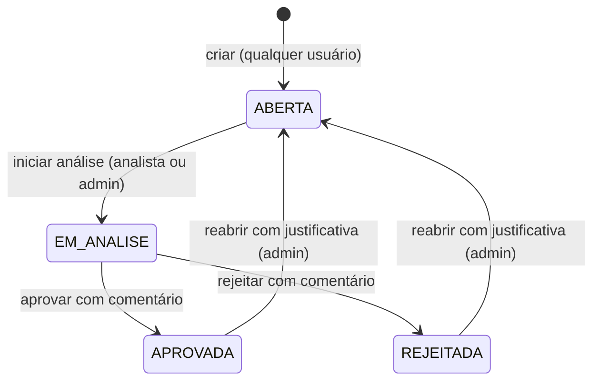

# Domínio e regras de negócio

Este documento descreve a solicitação interna, o ciclo de vida do status e as regras que o sistema aplica. Quem pode fazer cada ação está detalhado em [permissoes.md](permissoes.md). As tabelas e constraints estão em [modelo-de-dados.md](modelo-de-dados.md).

## Glossário

| Termo                | Significado                                                                       |
| -------------------- | --------------------------------------------------------------------------------- |
| Solicitação          | Pedido interno registrado por um colaborador e acompanhado até a decisão          |
| Solicitante          | Usuário que abriu a solicitação (sempre o usuário autenticado)                    |
| Área solicitante     | Área à qual o solicitante pertencia na criação                                    |
| Analista responsável | Quem iniciou a análise da solicitação                                             |
| Decisão              | Resultado (Aprovada ou Rejeitada) com comentário, autor e data                    |
| Reabertura           | Volta de uma solicitação decidida para Aberta, feita pelo Admin com justificativa |
| Histórico            | Registro imutável de tudo que aconteceu com a solicitação                         |

Convenção: termos de domínio em português (`Solicitacao`, `prioridade`, `EM_ANALISE`) e termos técnicos em inglês (`controller`, `repository`). Ver [ADR-011](decisoes.md#adr-011).

## Entidade Solicitação

| Campo             | Quem define       | Regra                                                                                                            |
| ----------------- | ----------------- | ---------------------------------------------------------------------------------------------------------------- |
| `codigo`          | Sistema           | Sequencial, exibido como `SOL-000123` (pelo menos 6 dígitos)                                                     |
| `titulo`          | Usuário           | Obrigatório, 5 a 120 caracteres, sem espaços nas pontas                                                          |
| `descricao`       | Usuário           | Obrigatória, até 5000 caracteres, com pelo menos 10 que não sejam espaço. Gravada como foi digitada              |
| `prioridade`      | Usuário           | `BAIXA`, `MEDIA` ou `ALTA`                                                                                       |
| `solicitante`     | Sistema           | Usuário autenticado. Imutável (P-01)                                                                             |
| `area`            | Sistema           | Área do solicitante na criação. Imutável (P-02)                                                                  |
| `dataSolicitacao` | Sistema           | Data e hora do servidor. Imutável (P-03)                                                                         |
| `status`          | Sistema           | Nasce `ABERTA` e só muda por comando (P-04)                                                                      |
| `analista`        | Sistema           | Preenchido quando alguém inicia a análise. Limpo numa reabertura                                                 |
| `decisao`         | Analista ou Admin | Resultado, comentário (10 a 2000 caracteres), autor e data. Limpa numa reabertura (a anterior fica no histórico) |
| `atualizadoEm`    | Sistema           | Última alteração                                                                                                 |
| `excluidoEm`      | Sistema           | Exclusão lógica                                                                                                  |
| `versao`          | Sistema           | Controle de concorrência otimista nas edições                                                                    |

O corpo da criação e da edição é estrito: enviar `status`, solicitante, área ou data devolve 400.

### O que significa cada prioridade

O formulário mostra esta explicação para orientar a escolha:

- **Alta**: impede ou compromete uma operação ou um atendimento.
- **Média**: afeta o trabalho, mas existe alternativa temporária.
- **Baixa**: melhoria ou pedido sem urgência.

## Ciclo de vida do status



| De                        | Para         | Comando         | Quem pode                   | Pré-condições                                    | Efeitos                                                                                                                            |
| ------------------------- | ------------ | --------------- | --------------------------- | ------------------------------------------------ | ---------------------------------------------------------------------------------------------------------------------------------- |
| (nova)                    | `ABERTA`     | Criar           | Qualquer usuário            | Dados válidos                                    | Histórico `CRIADA`                                                                                                                 |
| `ABERTA`                  | `EM_ANALISE` | Iniciar análise | Analista, Admin             | Não ser o solicitante                            | Define o analista. Histórico `ANALISE_INICIADA`                                                                                    |
| `EM_ANALISE`              | `APROVADA`   | Decidir         | Analista responsável, Admin | Não ser o solicitante. Comentário obrigatório    | Grava a decisão. Histórico `APROVADA`. Evento `SolicitacaoAprovada` na outbox                                                      |
| `EM_ANALISE`              | `REJEITADA`  | Decidir         | Analista responsável, Admin | Não ser o solicitante. Comentário obrigatório    | Grava a decisão. Histórico `REJEITADA`                                                                                             |
| `APROVADA` ou `REJEITADA` | `ABERTA`     | Reabrir         | Admin                       | Não ser o solicitante. Justificativa obrigatória | Limpa a decisão e o analista. Histórico `REABERTA` com a decisão anterior. Se era aprovada, evento `SolicitacaoReaberta` na outbox |

Qualquer outro par (status, comando) é recusado com `TransicaoInvalida` (409). Quando o Admin decide, o analista responsável continua o mesmo; o autor da decisão fica gravado à parte.

## Regras de negócio

| ID    | Regra                                                                                                                                                                                                |
| ----- | ---------------------------------------------------------------------------------------------------------------------------------------------------------------------------------------------------- |
| RN-01 | Toda solicitação nasce `ABERTA`. O solicitante é o usuário autenticado e a data vem do servidor. Qualquer cargo pode abrir solicitações, inclusive analistas                                         |
| RN-02 | Título, descrição e prioridade podem ser editados pelo solicitante enquanto o status for `ABERTA`, ou pelo Admin enquanto não houver decisão                                                         |
| RN-03 | O status nunca muda por edição genérica, só pelos comandos da máquina de estados                                                                                                                     |
| RN-04 | Só Analista ou Admin podem iniciar a análise. Quem inicia vira o analista responsável                                                                                                                |
| RN-05 | Só o analista responsável (ou um Admin) pode decidir uma solicitação `EM_ANALISE`                                                                                                                    |
| RN-06 | A decisão exige comentário de 10 a 2000 caracteres e registra o resultado, o autor e a data                                                                                                          |
| RN-07 | **Segregação de funções:** ninguém analisa, decide ou reabre a própria solicitação, nem o Admin                                                                                                      |
| RN-08 | Solicitações `APROVADA` e `REJEITADA` não aceitam edição, exclusão ou nova decisão. Só voltam a `ABERTA` por reabertura (RN-16)                                                                      |
| RN-09 | A exclusão é lógica. O solicitante só exclui a própria enquanto `ABERTA`. O Admin exclui enquanto não houver decisão. Decididas nunca são excluídas                                                  |
| RN-10 | Toda criação, edição, mudança de status, reabertura e exclusão gera um registro imutável no histórico (quem, quando, de/para, comentário)                                                            |
| RN-11 | Concorrência: uma transição só acontece se o status atual for o esperado (UPDATE condicional). Caso contrário, 409                                                                                   |
| RN-12 | Solicitações excluídas não aparecem em listagens, no detalhe nem no dashboard                                                                                                                        |
| RN-13 | Visibilidade: o solicitante vê só as próprias. Analista e Admin veem todas                                                                                                                           |
| RN-14 | A aprovação gera o evento `SolicitacaoAprovada` para a integração externa, na mesma transação                                                                                                        |
| RN-15 | Usuário inativo não faz login e perde o acesso na próxima requisição                                                                                                                                 |
| RN-16 | **Reabertura:** só o Admin reabre uma solicitação decidida, com justificativa de 10 a 2000 caracteres. Ela volta para `ABERTA`, sem analista e sem decisão. A decisão anterior continua no histórico |
| RN-17 | Reabrir uma solicitação **aprovada** gera o evento `SolicitacaoReaberta`, para o sistema externo desfazer o que fez com a aprovação. Reabrir uma rejeitada não gera evento                           |

### Detalhes que o código aplica

- **Edição:** exige a `versao` lida. Se outra pessoa alterou antes, a resposta é 409 `CONFLITO_DE_VERSAO`. Uma edição que não muda nenhum campo não gera evento nem nova versão.
- **Histórico da edição:** o evento `EDITADA` guarda, em `dados`, o valor anterior e o novo de cada campo alterado.
- **Histórico da reabertura:** o evento `REABERTA` guarda a justificativa como comentário e a decisão desfeita (resultado, comentário, data, autor e analista) em `dados`.
- **Tipos de evento no histórico:** `CRIADA`, `EDITADA`, `ANALISE_INICIADA`, `APROVADA`, `REJEITADA`, `REABERTA` e `EXCLUIDA`.
- **Hora do evento:** `clock_timestamp()` com microssegundos, para a linha do tempo seguir a ordem real de gravação.
- **Corrida entre requisições:** se o UPDATE condicional não afeta nenhuma linha, a API relê a solicitação e responde com o erro da regra que agora bloqueia.

### Garantias no banco

Algumas regras também são constraints, para valerem mesmo fora da API:

- decisão completa (comentário, autor e data) se, e somente se, o status for `APROVADA` ou `REJEITADA`;
- `EM_ANALISE` ou decidida exige analista;
- analista e autor da decisão diferentes do solicitante (RN-07);
- eventos `APROVADA`, `REJEITADA` e `REABERTA` sempre têm comentário;
- título com pelo menos 5 caracteres sem espaços nas pontas e descrição com pelo menos 10 caracteres que não sejam espaço.

## Erros de domínio

| Erro                       | Código                       | Quando                                                                         | HTTP |
| -------------------------- | ---------------------------- | ------------------------------------------------------------------------------ | ---- |
| `SolicitacaoNaoEncontrada` | `SOLICITACAO_NAO_ENCONTRADA` | Não existe, foi excluída ou o usuário não pode vê-la (a resposta não diz qual) | 404  |
| `AcessoNegado`             | `ACESSO_NEGADO`              | O usuário vê a solicitação, mas o cargo ou o papel não permite a ação          | 403  |
| `SegregacaoDeFuncoes`      | `SEGREGACAO_DE_FUNCOES`      | Tentativa de analisar, decidir ou reabrir a própria solicitação                | 403  |
| `TransicaoInvalida`        | `TRANSICAO_INVALIDA`         | O comando não vale para o status atual                                         | 409  |
| `EdicaoBloqueada`          | `EDICAO_BLOQUEADA`           | Edição ou exclusão fora do status permitido                                    | 409  |
| `ConflitoDeVersao`         | `CONFLITO_DE_VERSAO`         | A `versao` enviada não é a atual                                               | 409  |
| (validação)                | `DADOS_INVALIDOS`            | Corpo ou parâmetros inválidos                                                  | 400  |

As respostas de erro seguem o formato Problem Details (`application/problem+json`).

Nos comandos (iniciar análise, decidir, reabrir), a política confere as regras nesta ordem e devolve o erro da primeira que bloqueia: cargo (403), segregação de funções (403), status (409) e analista responsável (403). Na edição e na exclusão, a ordem é papel (dono ou Admin, 403) e depois status (409).

## Onde as regras ficam no código

- `apps/api/src/modules/solicitacoes/domain/maquina-de-estados.ts`: tabela de transições e `transicionar(status, comando)`, que devolve o novo status ou lança `TransicaoInvalida`. Os comandos são `INICIAR_ANALISE`, `APROVAR`, `REJEITAR` e `REABRIR`.
- `apps/api/src/modules/solicitacoes/domain/politicas.ts`: `verificarAcao(usuario, solicitacao, acao)` lança o erro da regra que bloqueia; `acoesPermitidas(usuario, solicitacao)` devolve as ações liberadas, por exemplo `['EDITAR', 'EXCLUIR']` ou `['REABRIR']`. A **mesma função** bloqueia a ação na API e define os botões na interface, que recebe a lista no campo `acoesPermitidas` do detalhe.
- As duas são funções puras, com testes em tabela que cobrem as combinações de cargo, status e dono (`maquina-de-estados.spec.ts`, `politicas.spec.ts`).
- `apps/api/src/modules/solicitacoes/application/solicitacoes.service.ts`: casos de uso. Cada um roda numa transação com o contexto do usuário no banco, aplica a política e grava a mudança e o histórico juntos.

## Auditoria do histórico

A imutabilidade do histórico (RN-10) vem das permissões: o papel da API (`app_runtime`) só tem `SELECT` e `INSERT` em `solicitacao_historico`. Uma corrente de hashes acrescenta **detecção** de adulteração feita por quem tem acesso mais alto ao banco.

### Como a corrente funciona

- Cada solicitação tem a própria corrente. Eventos de solicitações diferentes não disputam o mesmo "último hash".
- Cada evento guarda `hash_anterior` e `hash` (SHA-256 em hexadecimal, `char(64)`).
- Um trigger `BEFORE INSERT` calcula os dois valores. Nenhum caminho de escrita escapa, e quem insere não escolhe o valor: o trigger sobrescreve o que for informado.
- `hash = sha256(hash_anterior || '|' || conteúdo canônico)`. O `hash_anterior` é o `hash` do último evento da mesma solicitação, na ordem `(criado_em, id)`. O primeiro evento parte de uma semente fixa (64 zeros).
- Conteúdo canônico, na ordem, separado por `|`, com `NULL` como texto vazio: `solicitacao_id`, `tipo`, `status_anterior`, `status_novo`, `autor_id`, `comentario`, `dados` (forma textual do jsonb) e `criado_em` em UTC com microssegundos.

### Verificação

`GET /api/v1/auditoria/integridade`, **só Admin** (403 para os outros cargos). A consulta recalcula todas as correntes no banco e devolve:

```json
{
  "integro": false,
  "eventosVerificados": 412,
  "solicitacoesVerificadas": 40,
  "totalDivergencias": 1,
  "divergencias": [
    {
      "solicitacao": { "id": "…", "codigo": "SOL-000012" },
      "eventoId": "…",
      "tipo": "APROVADA",
      "criadoEm": "…",
      "motivo": "CONTEUDO_ALTERADO"
    }
  ],
  "verificadoEm": "…"
}
```

- `CONTEUDO_ALTERADO`: o hash recalculado do conteúdo não bate com o `hash` gravado.
- `CORRENTE_QUEBRADA`: o conteúdo confere, mas o `hash_anterior` não bate com o `hash` do evento anterior (evento apagado ou inserido no meio).
- Um evento com as duas falhas aparece uma vez, como `CONTEUDO_ALTERADO`.
- `divergencias` traz até 20 itens, do mais antigo para o mais recente. `totalDivergencias` traz o total.
- Solicitações excluídas logicamente entram na verificação.

No painel do Admin, o card "Integridade do histórico" chama esse endpoint e mostra o resultado.

> [!IMPORTANT]
> A corrente detecta alteração e remoção **no meio**. Ela não detecta a remoção do **último** evento de uma solicitação, nem uma reescrita completa por quem recalcular todos os hashes. Em produção, a solução é ancorar periodicamente o hash mais recente de cada corrente fora do banco, num armazenamento imutável (WORM) ou num log externo. Ver também [Limitações conhecidas](../README.md#limitações-conhecidas).
